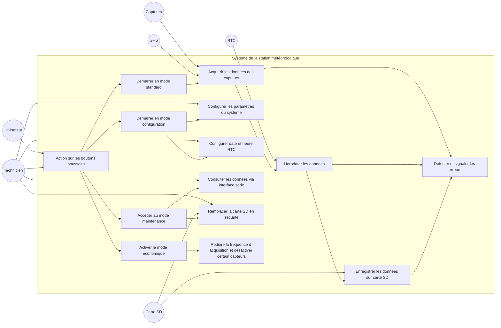

# 🌦️ Station Météo – Projet Arduino / Grove

## 📌 Présentation du projet
Ce projet consiste à développer une station météorologique autonome intégrant :
- Capteurs environnementaux (température, humidité, pression…)
- Module GPS v1.2
- Horloge RTC v1.2
- Stockage sur carte SD
- Modes utilisateur (standard, configuration, maintenance, économie)
- Gestion d’erreurs et boutons poussoirs

---

## 🎯 Objectifs
- Acquérir et horodater des données environnementales
- Enregistrer les données sur carte SD
- Permettre la configuration via interface série
- Assurer un fonctionnement robuste et autonome

---

## 🧩 Architecture générale du système

