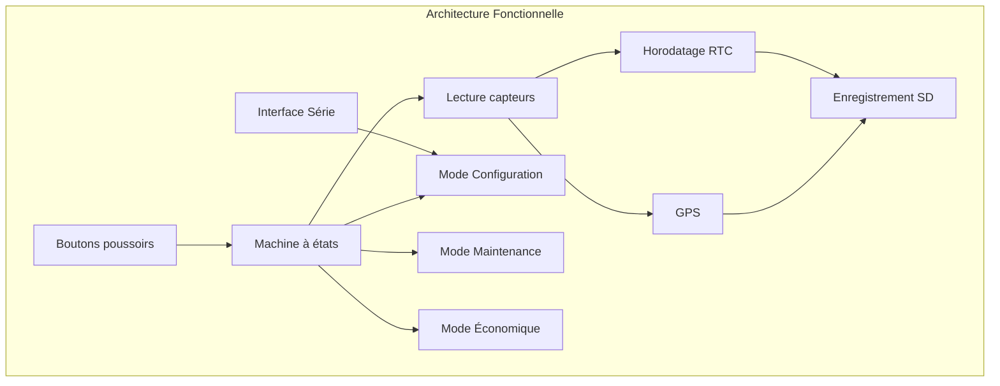

# 🌦️ Station Météo – Projet Arduino / Grove

## Présentation du projet
L'Agence Internationale pour la Vigilance Météorologique (AIVM) se lance dans un projet ambitieux : déployer dans les océans des navires de surveillance équipés de stations météo embarquées chargées de mesurer les paramètres influant sur la formation de cyclones ou autres catastrophes naturelles.

Un grand nombre de sociétés utilisant des transports navals ont accepté d'équiper leurs bateaux avec ces stations embarquées. En revanche, ces dernières devront être simples et efficaces et pilotables par un des membres de l'équipage (une documentation technique utilisateur sera mise à disposition).


---

## Objectifs
- Acquérir et horodater des données environnementales
- Enregistrer les données sur carte SD
- Permettre la configuration via interface série
- Assurer un fonctionnement robuste et autonome

---

## Structure générale du programme : 

```mermaid

flowchart TD

    A([setup()]) --> B[initLibraries()]
    B --> C[initSensors()]
    B --> D[initGPS()]
    B --> E[initRTC()]
    B --> F[initSD()]
    B --> G[loadConfig()]

    H([loop()]) --> I[handleButtons()]
    I --> J{Mode}

    J -->|STANDARD| K[collectData()]
    J -->|CONFIG| L[processSerialCommands()]
    J -->|MAINTENANCE| M[displayMaintenance()]
    J -->|ECO| N[ecoCollect()]

    K --> O[writeSD()]
    K --> P[Lecture capteurs]
    P --> Q[Add_Val()]
```
```mermaid

flowchart TD

    A[Vert fixe] --> S[Standard]
    B[Jaune fixe] --> C[Configuration]
    D[Bleu fixe] --> E[Économique]
    F[Orange fixe] --> M[Maintenance]

    H[Rouge/Bleu 1Hz] --> I[Erreur RTC]
    J[Rouge/Jaune 1Hz] --> K[Erreur GPS]
    L[Rouge/Vert 1Hz] --> N[Erreur capteur]
    O[Rouge/Vert (vert x2)] --> P[Capteur incohérent]
    Q[Rouge/Blanc 1Hz] --> R[SD pleine]
    S[Rouge/Blanc (blanc x2)] --> T[Erreur écriture SD]

flowchart LR

    S[Standard] -->|Bouton rouge 5s| M[Maintenance]
    S -->|Bouton vert 5s| E[Économique]
    S -->|Bouton rouge au démarrage| C[Configuration]

    M -->|Bouton rouge 5s| S
    E -->|Bouton rouge 5s| S

    C -->|30 min inactivité| S
```

