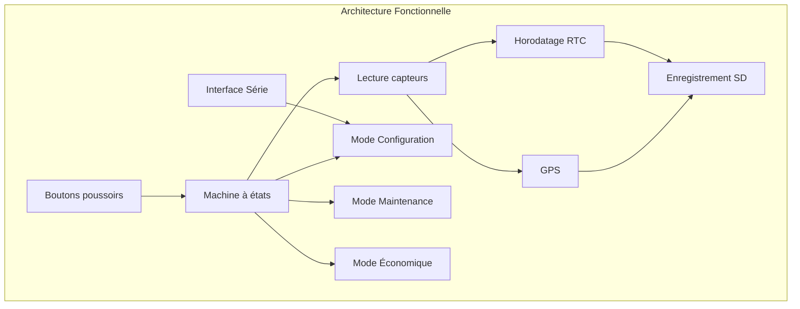

# 🌦️ Station Météo – Projet Arduino / Grove

## Présentation du projet
L'Agence Internationale pour la Vigilance Météorologique (AIVM) se lance dans un projet ambitieux : déployer dans les océans des navires de surveillance équipés de stations météo embarquées chargées de mesurer les paramètres influant sur la formation de cyclones ou autres catastrophes naturelles.

Un grand nombre de sociétés utilisant des transports navals ont accepté d'équiper leurs bateaux avec ces stations embarquées. En revanche, ces dernières devront être simples et efficaces et pilotables par un des membres de l'équipage (une documentation technique utilisateur sera mise à disposition).

---

## Objectifs
- Acquérir et horodater des données environnementales
- Enregistrer les données sur carte SD
- Permettre la configuration via interface série
- Assurer un fonctionnement robuste et autonome

---

## Structure générale du programme : 

// --- Bibliothèques ---
#include <EEPROM.h>
#include <RTClib.h>
#include <Wire.h>
#include <SoftwareSerial.h>
#include <SD.h>
#include <DHT.h>
#include <Rgb_lcd.h>
#include <ChainableLED.h>
#include <BH1750.h>

// --- Modes ---
enum Mode { STANDARD, CONFIG, MAINTENANCE, ECO };
Mode actualMod, lastMod;

// --- Capteurs ---
const int NB_CAPTEURS = 4;
const int NB_VAL = 10;

struct Capteur {
    float moy_gliss[NB_VAL];
    int nb_erreur;
};

Capteur capteurs[NB_CAPTEURS];
int ind_moy = 0;

// --- Paramètres système ---
struct ConfigParams {
    int LOG_INTERVAL;
    int FILE_MAX_SIZE;
    int TIMEOUT;
    int LUMIN_LOW;
    int LUMIN_HIGH;
    int MIN_TEMP_AIR;
    int MAX_TEMP_AIR;
};
ConfigParams config;

// --- Fichiers SD ---
File myFile;
char nomFichier[20];
void setup() {

    initLED();
    initButtons();
    initSensors();
    initGPS();
    initRTC();
    initSD();
    loadConfigEEPROM();

    actualMod = STANDARD;
    updateLED(actualMod);
}
void loop() {

    handleButtons();  // Détection appui court / long

    switch(actualMod) {

        case STANDARD:
            collectData(config.LOG_INTERVAL);
            break;

        case CONFIG:
            processSerialCommands();
            break;

        case MAINTENANCE:
            displayMaintenance();
            break;

        case ECO:
            collectData(config.LOG_INTERVAL * 2);
            break;
    }
}
void Lecture(float* tab_val, int* erreurs) {

    float mesure;
    bool erreur;

    for (int i = 0; i < NB_CAPTEURS; i++) {

        mesure = 0;
        erreur = Lecture_capteur(&mesure, i);

        if (erreur) {
            erreurs[i]++;
        } else {
            Add_Val(tab_val, mesure);
        }
    }
}
void Lecture(float* tab_val, int* erreurs) {

    float mesure;
    bool erreur;

    for (int i = 0; i < NB_CAPTEURS; i++) {

        mesure = 0;
        erreur = Lecture_capteur(&mesure, i);

        if (erreur) {
            erreurs[i]++;
        } else {
            Add_Val(tab_val, mesure);
        }
    }
}
void Add_Val(float* tab_moy, float val) {

    tab_moy[ind_moy] = val;

    if (ind_moy >= NB_VAL - 1)
        ind_moy = 0;
    else
        ind_moy++;
}
void collectData(int interval) {

    if (millis() - lastMeasure >= interval) {

        float temp = collectTemperature();
        float hum  = collectHumidity();
        int lum    = collectLuminosity();
        String gps = getGPSData();

        writeSD(temp, hum, lum, gps);

        lastMeasure = millis();
    }
}
void changeMode(Mode newMode) {
    lastMod = actualMod;
    actualMod = newMode;
    updateLED(newMode);
}

