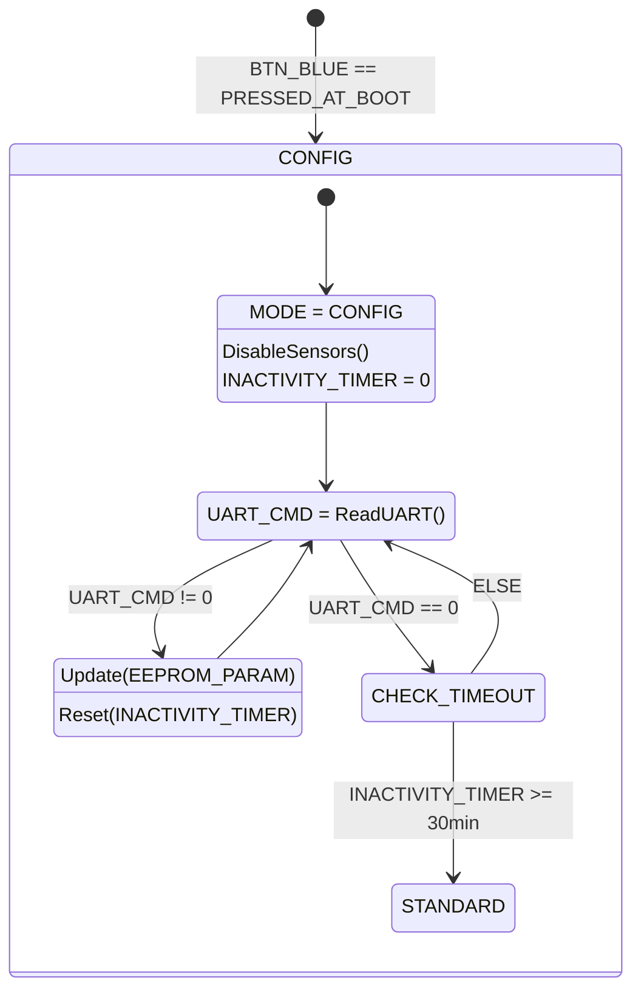
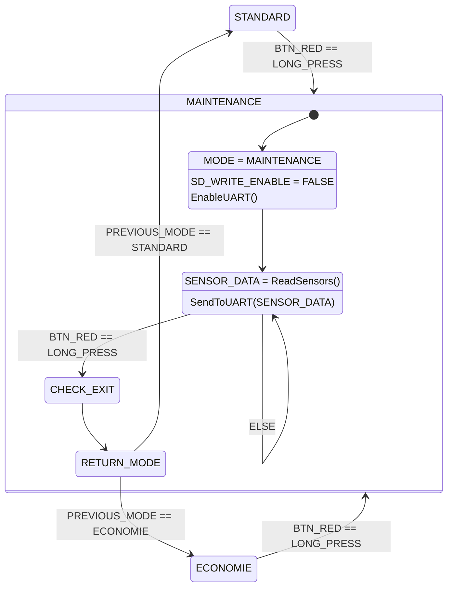
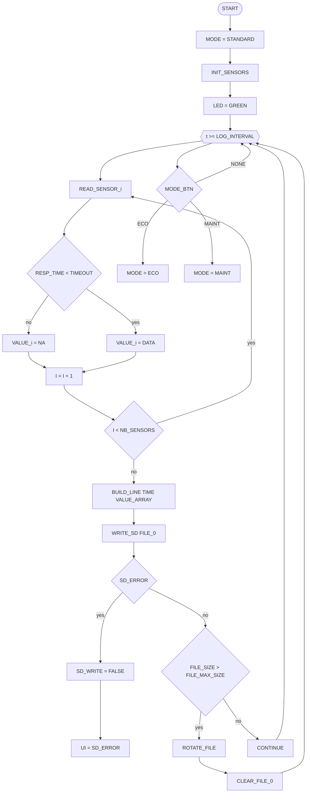
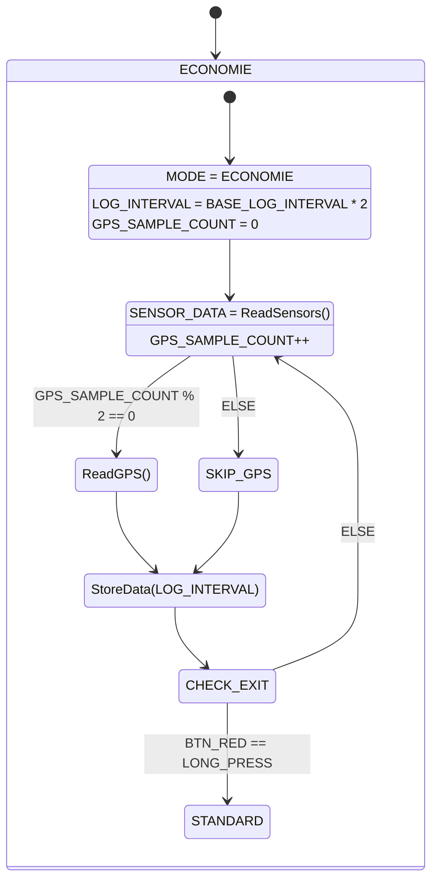

## Station Météo – Projet Arduino / Grove

## Présentation du projet
L'Agence Internationale pour la Vigilance Météorologique (AIVM) se lance dans un projet ambitieux : déployer dans les océans des navires de surveillance équipés de stations météo embarquées chargées de mesurer les paramètres influant sur la formation de cyclones ou autres catastrophes naturelles.

Un grand nombre de sociétés utilisant des transports navals ont accepté d'équiper leurs bateaux avec ces stations embarquées. En revanche, ces dernières devront être simples et efficaces et pilotables par un des membres de l'équipage (une documentation technique utilisateur sera mise à disposition).


---

## Objectifs
- Acquérir et horodater des données environnementales
- Enregistrer les données sur carte SD
- Permettre la configuration via interface série
- Assurer un fonctionnement robuste et autonome

---

## Structure générale du programme : 

<1> Déclarations globales
```ccp
// -------------------------------------------------------------
// Bibliothèques nécessaires (abstraction des modules matériels)
// -------------------------------------------------------------
IMPORT EEPROM
IMPORT RTC
IMPORT I2C
IMPORT GPS
IMPORT SD
IMPORT Capteur_Temp_Hum
IMPORT LCD_RGB
IMPORT LED_RGB
IMPORT Capteur_Luminosite

// -------------------------------------------------------------
// Définition des modes de fonctionnement
// -------------------------------------------------------------
ENUM Mode = { STANDARD, CONFIG, MAINTENANCE, ECO }
VARIABLE actualMod
VARIABLE lastMod

// -------------------------------------------------------------
// Paramètres liés aux capteurs
// -------------------------------------------------------------
CONSTANTE NB_CAPTEURS = 3
CONSTANTE NB_VAL = 10

STRUCTURE Capteur
    Tableau moy_gliss[NB_VAL]
    Entier nb_erreur
FIN STRUCTURE

TABLEAU capteurs[NB_CAPTEURS]
VARIABLE ind_moy = 0

// -------------------------------------------------------------
// Paramètres système sauvegardés
// -------------------------------------------------------------
STRUCTURE ConfigParams
    LOG_INTERVAL
    FILE_MAX_SIZE
    TIMEOUT
    LUMIN_LOW
    LUMIN_HIGH
    MIN_TEMP_AIR
    MAX_TEMP_AIR
FIN STRUCTURE

VARIABLE config

// -------------------------------------------------------------
// Gestion du stockage SD
// -------------------------------------------------------------
VARIABLE myFile
VARIABLE nomFichier

// -------------------------------------------------------------
// Prototype : vérification des limites d’une valeur capteur
// -------------------------------------------------------------
FONCTION checkLimits(value, minVal, maxVal)
```
Commentaire :
Cette section définit la structure globale du système : les modules matériels utilisés, les modes de fonctionnement, les structures de données pour les capteurs et les paramètres configurables. Elle prépare également les variables nécessaires à la gestion du stockage et à la validation des mesures.

<2> Initialisation (setup)

```ccp
// -------------------------------------------------------------
// Procédure d'initialisation au démarrage
// -------------------------------------------------------------
PROCÉDURE setup()

    INITIALISER LED_RGB
    INITIALISER Boutons
    INITIALISER Capteurs
    INITIALISER GPS
    INITIALISER RTC
    INITIALISER Carte_SD

    CHARGER config DEPUIS EEPROM

    actualMod ← STANDARD
    METTRE_A_JOUR LED_SELON(actualMod)

FIN PROCÉDURE
```
Commentaire :
Cette procédure est exécutée une seule fois au démarrage. Elle initialise tous les modules matériels et charge la configuration sauvegardée. Le système démarre en mode STANDARD.

<3> Changement de modes (loop)
```ccp
// -------------------------------------------------------------
// Boucle principale : gestion des modes
// -------------------------------------------------------------
PROCÉDURE loop()

    ANALYSER Boutons

    SELON actualMod FAIRE

        CAS STANDARD :
            collectData(config.LOG_INTERVAL)

        CAS CONFIG :
            TRAITER Commandes_Série

        CAS MAINTENANCE :
            AFFICHER Données_Directes

        CAS ECO :
            collectData(config.LOG_INTERVAL × 2)

    FIN SELON

FIN PROCÉDURE
```
Commentaire :
La boucle principale implémente la machine à états. En fonction du mode actif, le comportement du système change dynamiquement.

<4> Lecture des capteurs (avec pointeurs)
```ccp
// -------------------------------------------------------------
// Lecture générique de l’ensemble des capteurs
// -------------------------------------------------------------
PROCÉDURE Lecture(tab_val, erreurs)

    POUR i DE 0 À NB_CAPTEURS - 1 FAIRE

        mesure ← LIRE_Capteur(i)

        SI erreur DÉTECTÉE ALORS
            erreurs[i] ← erreurs[i] + 1
        SINON
            Add_Val(tab_val, mesure)
        FIN SI

    FIN POUR

FIN PROCÉDURE
```
Commentaire :
Cette procédure centralise la lecture des capteurs. En cas d’erreur, un compteur est incrémenté. Sinon, la valeur valide est ajoutée dans la mémoire de moyenne glissante.

<5> Moyenne glissante
```ccp
// -------------------------------------------------------------
// Gestion du tampon circulaire pour moyenne glissante
// -------------------------------------------------------------
PROCÉDURE Add_Val(tab_moy, val)

    tab_moy[ind_moy] ← val

    SI ind_moy ≥ NB_VAL - 1 ALORS
        ind_moy ← 0
    SINON
        ind_moy ← ind_moy + 1
    FIN SI

FIN PROCÉDURE
```
Commentaire :
Les mesures sont stockées dans un tableau circulaire afin de lisser les variations et conserver uniquement les valeurs récentes.

<6> Vérification des limites : checkLimits()
```ccp
// -------------------------------------------------------------
// Validation d’une mesure selon les seuils définis
// -------------------------------------------------------------
FONCTION checkLimits(value, minVal, maxVal)

    SI value est INVALIDE ALORS
        RETOURNER "NA"

    SI value < minVal OU value > maxVal ALORS
        RETOURNER "Valeur Hors-Limite"

    RETOURNER value_convertie_en_texte

FIN FONCTION
```
Commentaire :
Cette fonction garantit que seules les valeurs cohérentes sont exploitées. Elle filtre les capteurs non répondants et les mesures hors intervalle.

<7> Collecte + enregistrement SD
```ccp
// -------------------------------------------------------------
// Acquisition des données et stockage périodique
// -------------------------------------------------------------
PROCÉDURE collectData(interval)

    SI Temps_Écoulé ≥ interval ALORS

        temp ← Lire_Température()
        hum  ← Lire_Humidité()
        lum  ← Lire_Luminosité()
        gps  ← Lire_GPS()

        tempStr ← checkLimits(temp, MIN_TEMP_AIR, MAX_TEMP_AIR)
        humStr  ← checkLimits(hum, 0, 100)
        lumStr  ← checkLimits(lum, LUMIN_LOW, LUMIN_HIGH)

        ÉCRIRE tempStr, humStr, lumStr, gps SUR Carte_SD

        METTRE_À_JOUR Timer

    FIN SI

FIN PROCÉDURE
```
Commentaire :
Cette procédure constitue le cœur fonctionnel du système. Elle réalise l’acquisition des données, vérifie leur validité, puis les enregistre sur la carte SD à intervalles réguliers.

## Diagrammes détaillants le fonctionnement du système (les commentaires des diagrammes sont dans "code") : 
## Mode Configuration

## Mode Maintenance

## Mode Standard

## Mode Economique 

