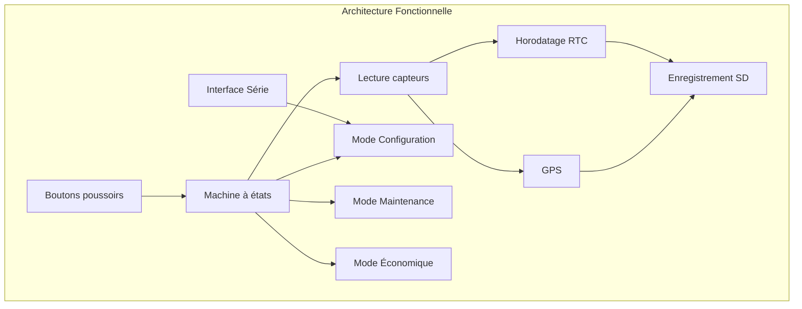

# 🌦️ Station Météo – Projet Arduino / Grove

## Présentation du projet
L'Agence Internationale pour la Vigilance Météorologique (AIVM) se lance dans un projet ambitieux : déployer dans les océans des navires de surveillance équipés de stations météo embarquées chargées de mesurer les paramètres influant sur la formation de cyclones ou autres catastrophes naturelles.

Un grand nombre de sociétés utilisant des transports navals ont accepté d'équiper leurs bateaux avec ces stations embarquées. En revanche, ces dernières devront être simples et efficaces et pilotables par un des membres de l'équipage (une documentation technique utilisateur sera mise à disposition).

---

## Objectifs
- Acquérir et horodater des données environnementales
- Enregistrer les données sur carte SD
- Permettre la configuration via interface série
- Assurer un fonctionnement robuste et autonome

---

## Structure générale du programme : 

