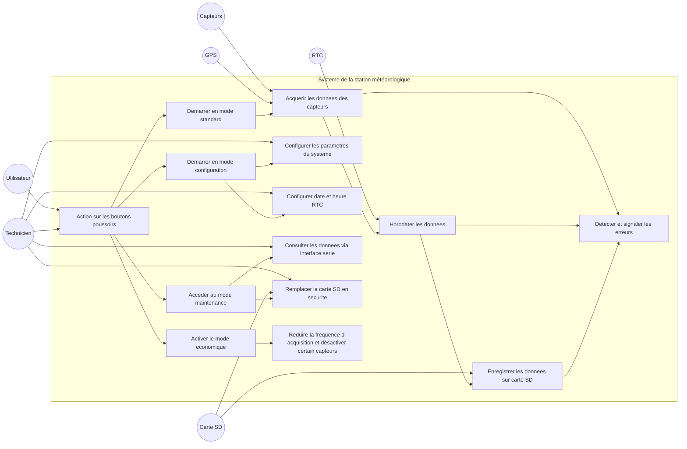
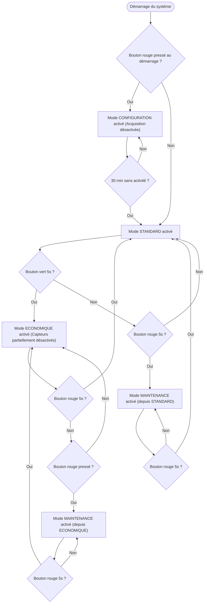

# 🌦️ Station Météo – Projet Arduino / Grove

## 📌 Présentation du projet
Ce projet consiste à développer une station météorologique autonome intégrant :
- Capteurs environnementaux (température, humidité, pression…)
- Module GPS v1.2
- Horloge RTC v1.2
- Stockage sur carte SD
- Modes utilisateur (standard, configuration, maintenance, économie)
- Gestion d’erreurs et boutons poussoirs

---

## 🎯 Objectifs
- Acquérir et horodater des données environnementales
- Enregistrer les données sur carte SD
- Permettre la configuration via interface série
- Assurer un fonctionnement robuste et autonome

---

## 🧩 Architecture générale du système

// -------------------------------------------------------------
// 📚 Bibliothèques nécessaires pour le projet
// -------------------------------------------------------------
#include "EEPROM.h"              // Stocke et récupère les paramètres de configuration
#include "RTClib.h"              // Manipule l'horloge temps réel (RTC) DS1307
#include "Wire.h"                // Communication I2C
#include "SoftwareSerial.h"      // Communication série avec un module GPS
#include "SD.h"                  // Lire et écrire les données sur une carte SD
#include "DHT.h"                 // Capteur DHT11 (température / humidité)
#include "Rgb_lcd.h"             // Écran LCD RGB
#include "ChainableLED.h"        // LED RGB
#include "BH1750.h"              // Capteur de luminosité

// -------------------------------------------------------------
// ⚙️ Constantes EEPROM
// -------------------------------------------------------------
ADDR_LOG_INTERVAL, ADDR_TEMP_LIMIT, ADDR_HUMIDITY_LIMIT, ADDR_LUMINOSITY_LIMIT

// Paramètres par défaut
DEFAULT_LOG_INTERVAL, DEFAULT_TEMP_LIMIT, DEFAULT_HUMIDITY_LIMIT, DEFAULT_LUMINOSITY_LIMIT

// -------------------------------------------------------------
// 🧩 Objets capteurs et modules
// -------------------------------------------------------------
rtc : RTC_DS1307
dht : DHT
SoftSerial : SoftwareSerial
lcd : Rgb_lcd
leds : ChainableLED
bh1750 : BH1750

// -------------------------------------------------------------
// 🔘 Boutons poussoirs
// -------------------------------------------------------------
volatile bool RBPushed, GBPushed
volatile unsigned long lastPushRB, lastPushGB

// -------------------------------------------------------------
// 🔄 Modes de fonctionnement
// -------------------------------------------------------------
enum Enum_Mod {STANDARD, CONFIG, MAINTENANCE, ECO}
Enum_Mod actualMod, lastMod

// -------------------------------------------------------------
// 🛠️ Paramètres de configuration
// -------------------------------------------------------------
ConfigParameters configParams

// -------------------------------------------------------------
// ⏱️ Variables liées au temps
// -------------------------------------------------------------
unsigned long lastActivity, lastMeasure
const unsigned long inactivityDuration = 30000 // 30 secondes

// -------------------------------------------------------------
// 💾 Variables liées au fichier
// -------------------------------------------------------------
File myFile
char nomDufichier[20]

// -------------------------------------------------------------
// 📺 Variables liées à l'écran LCD
// -------------------------------------------------------------
long lUpdate
int displayState

// -------------------------------------------------------------
// 📄 Création d’un nom de fichier unique
// -------------------------------------------------------------
fonction createNameFile(DateTime now, int revision)
    fichier = "data_" + now.getYear() + "_" + now.getMonth() + "_" +
              now.getDay() + "_" + now.getHour() + "_" +
              now.getMinute() + "_" + revision + ".txt"
    retourner fichier
FIN FONCTION

// -------------------------------------------------------------
// 📏 Vérifier la taille du fichier SD
// -------------------------------------------------------------
fonction verifySizeFile(DateTime now, int revision)
    si (tailleFichier > limite)
        nouveauFichier = createNameFile(now, revision + 1)
        retourner nouveauFichier
    sinon
        retourner fichierActuel
    fin si
FIN FONCTION

// -------------------------------------------------------------
// 💾 Écriture des données sur SD
// -------------------------------------------------------------
fonction writeSD(float temperature, float humidity, String lumens, String gpsData)
    écrire("Température: " + temperature +
           ", Humidité: " + humidity +
           ", Luminosité: " + lumens +
           ", GPS: " + gpsData) dans myFile
FIN FONCTION

// -------------------------------------------------------------
// ✔️ Vérifications capteurs
// -------------------------------------------------------------
fonction veriftemp(int i)
    si (lectureTemperature valide)
        retourner vrai
    sinon
        retourner faux
FIN FONCTION

fonction verifhum(int i)
    si (lectureHumidité valide)
        retourner vrai
    sinon
        retourner faux
FIN FONCTION

fonction veriflum(int i)
    si (lectureLuminosité valide)
        retourner vrai
    sinon
        retourner faux
FIN FONCTION

// -------------------------------------------------------------
// 📡 Collecte des données capteurs
// -------------------------------------------------------------
fonction collectLuminosity()
    sensorValue = lireValeurLuminosité()
    retourner sensorValue
FIN FONCTION

fonction collectTemperature()
    temperature = lireTemperature()
    si (temperature >= limiteMin && temperature <= limiteMax)
        retourner temperature
    sinon
        retourner erreur
FIN FONCTION

fonction collectHumidity()
    humidity = lireHumidité()
    si (humidity >= limiteMin && humidity <= limiteMax)
        retourner humidity
    sinon
        retourner erreur
FIN FONCTION

fonction readGPS()
    gpsData = lireGPS()
    retourner gpsData
FIN FONCTION

// -------------------------------------------------------------
// 🧪 Initialisation des capteurs
// -------------------------------------------------------------
fonction initSensors()
    initialiserCapteurDHT()
    initialiserModuleGPS()
FIN FONCTION

// -------------------------------------------------------------
// 🔄 Changement de mode
// -------------------------------------------------------------
fonction changeMode(Mod newMod)
    actualMod = newMod
FIN FONCTION

// -------------------------------------------------------------
// 📥 Collecte + écriture SD
// -------------------------------------------------------------
fonction collectData(long timeIntervalle)
    si (currentTime - lastMeasure >= timeIntervalle)
        lum = collectLuminosity()
        gpsData = readGPS()
        temperature = collectTemperature()
        humidity = collectHumidity()
        writeSD(temperature, humidity, lum, gpsData)
        lastMeasure = currentTime
    fin si
FIN FONCTION

// -------------------------------------------------------------
// 🔘 Interruptions boutons
// -------------------------------------------------------------
fonction interruptRB()
    // Action bouton RB
FIN FONCTION

fonction interruptGB()
    // Action bouton GB
FIN FONCTION

// -------------------------------------------------------------
// ⏳ Détection appui long
// -------------------------------------------------------------
fonction longPushButton(volatile unsigned long& lastPush, volatile bool& pushButton)
    si (currentTime - lastPush >= 5000)
        pushButton = vrai
    sinon
        pushButton = faux
FIN FONCTION

// -------------------------------------------------------------
// 🛠️ Affichage maintenance
// -------------------------------------------------------------
fonction displayMaintenance()
    // Affichage LCD
FIN FONCTION

// -------------------------------------------------------------
// ⚙️ Configuration système
// -------------------------------------------------------------
fonction configParam(String command, int hour, int minute, int second,
                     int month, int day, int year, int dayOfWeek)
    // Mise à jour EEPROM
FIN FONCTION

fonction resetDefaults()
    // Réinitialisation EEPROM
FIN FONCTION

// -------------------------------------------------------------
// 🚀 Setup
// -------------------------------------------------------------
fonction setup()
    initial
