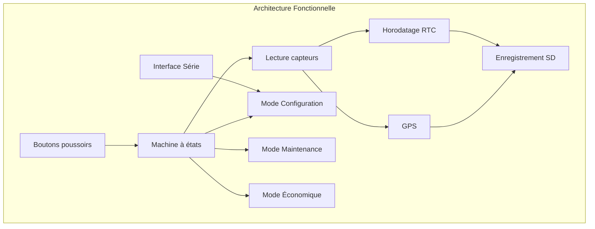
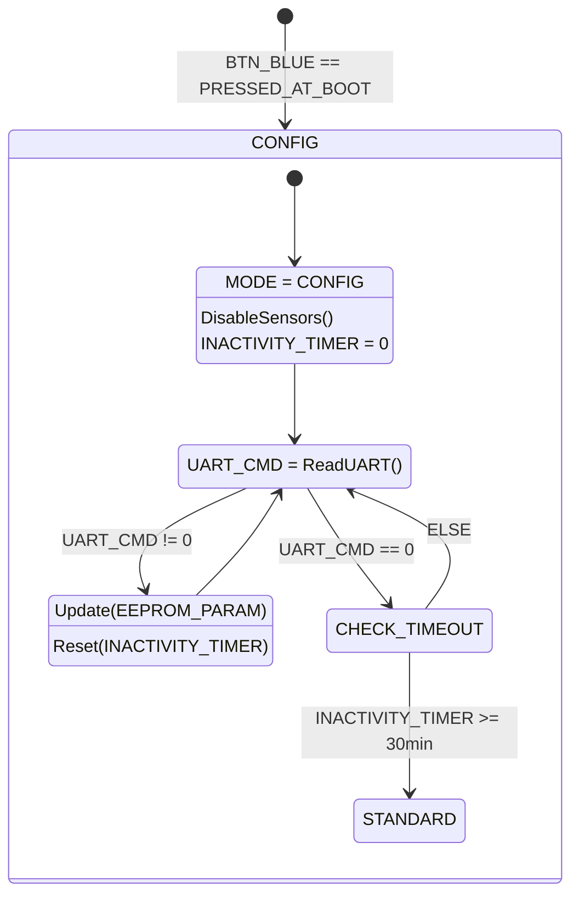

# 🌦️ Station Météo – Projet Arduino / Grove

## Présentation du projet
L'Agence Internationale pour la Vigilance Météorologique (AIVM) se lance dans un projet ambitieux : déployer dans les océans des navires de surveillance équipés de stations météo embarquées chargées de mesurer les paramètres influant sur la formation de cyclones ou autres catastrophes naturelles.

Un grand nombre de sociétés utilisant des transports navals ont accepté d'équiper leurs bateaux avec ces stations embarquées. En revanche, ces dernières devront être simples et efficaces et pilotables par un des membres de l'équipage (une documentation technique utilisateur sera mise à disposition).

---

## Objectifs
- Acquérir et horodater des données environnementales
- Enregistrer les données sur carte SD
- Permettre la configuration via interface série
- Assurer un fonctionnement robuste et autonome

---

## Structure générale du programme : 

1. Déclarations globales

// -------------------------------------------------------------
// 📚 Bibliothèques nécessaires
// -------------------------------------------------------------
#include <EEPROM.h>          // Gestion des paramètres sauvegardés
#include <RTClib.h>          // Horloge temps réel (RTC)
#include <Wire.h>            // Bus I2C
#include <SoftwareSerial.h>  // GPS via port série logiciel
#include <SD.h>              // Carte SD
#include <DHT.h>             // Capteur température / humidité
#include <Rgb_lcd.h>         // Écran LCD RGB
#include <ChainableLED.h>    // LED RGB
#include <BH1750.h>          // Capteur de luminosité

// -------------------------------------------------------------
// 🔘 Modes de fonctionnement
// -------------------------------------------------------------
enum Mode { STANDARD, CONFIG, MAINTENANCE, ECO };
Mode actualMod, lastMod;

// -------------------------------------------------------------
// 🌡️ Gestion des capteurs
// -------------------------------------------------------------
const int NB_CAPTEURS = 4;   // Nombre total de capteurs
const int NB_VAL = 10;       // Taille de la moyenne glissante

struct Capteur {
    float moy_gliss[NB_VAL]; // Tableau pour moyenne glissante
    int nb_erreur;           // Compteur d’erreurs successives
};

Capteur capteurs[NB_CAPTEURS];
int ind_moy = 0;             // Index circulaire pour la moyenne glissante

// -------------------------------------------------------------
// ⚙️ Paramètres système (EEPROM)
// -------------------------------------------------------------
struct ConfigParams {
    int LOG_INTERVAL;        // Intervalle entre mesures
    int FILE_MAX_SIZE;       // Taille max fichier SD
    int TIMEOUT;             // Timeout capteurs
    int LUMIN_LOW;           // Seuil luminosité faible
    int LUMIN_HIGH;          // Seuil luminosité forte
    int MIN_TEMP_AIR;        // Température min valide
    int MAX_TEMP_AIR;        // Température max valide
};
ConfigParams config;

// -------------------------------------------------------------
// 💾 Gestion des fichiers SD
// -------------------------------------------------------------
File myFile;
char nomFichier[20];

2. Initialisation (setup)

// -------------------------------------------------------------
// 🚀 Initialisation du système
// -------------------------------------------------------------
void setup() {

    initLED();              // LED RGB (état du système)
    initButtons();          // Boutons poussoirs
    initSensors();          // DHT, BH1750, etc.
    initGPS();              // GPS via SoftwareSerial
    initRTC();              // Horloge RTC
    initSD();               // Carte SD
    loadConfigEEPROM();     // Chargement des paramètres utilisateur

    actualMod = STANDARD;   // Mode par défaut
    updateLED(actualMod);   // Mise à jour de la LED selon le mode
}

3. Machine à états (loop)

// -------------------------------------------------------------
// 🔄 Boucle principale : machine à états
// -------------------------------------------------------------
void loop() {

    handleButtons();  // Détection des appuis courts / longs

    switch(actualMod) {

        case STANDARD:
            // Mode normal : acquisition régulière
            collectData(config.LOG_INTERVAL);
            break;

        case CONFIG:
            // Mode configuration via interface série
            processSerialCommands();
            break;

        case MAINTENANCE:
            // Mode maintenance : affichage direct, SD désactivée
            displayMaintenance();
            break;

        case ECO:
            // Mode économie : fréquence divisée par 2
            collectData(config.LOG_INTERVAL * 2);
            break;
    }
}

4. Lecture des capteurs (avec pointeurs)

// -------------------------------------------------------------
// 📡 Lecture générique des capteurs via pointeurs
// -------------------------------------------------------------
void Lecture(float* tab_val, int* erreurs) {

    float mesure;
    bool erreur;

    for (int i = 0; i < NB_CAPTEURS; i++) {

        mesure = 0;

        // Lecture du capteur i (renvoie true si erreur)
        erreur = Lecture_capteur(&mesure, i);

        if (erreur) {
            erreurs[i]++;          // Incrémentation du compteur d’erreurs
        } else {
            Add_Val(tab_val, mesure); // Ajout dans la moyenne glissante
        }
    }
}

5. Moyenne glissante

// -------------------------------------------------------------
// 📊 Ajout d’une valeur dans la moyenne glissante
// -------------------------------------------------------------
void Add_Val(float* tab_moy, float val) {

    tab_moy[ind_moy] = val;   // Ajout à l’index courant

    // Index circulaire
    if (ind_moy >= NB_VAL - 1)
        ind_moy = 0;
    else
        ind_moy++;
}

6. Collecte + enregistrement SD

// -------------------------------------------------------------
// 💾 Collecte des données + écriture sur SD
// -------------------------------------------------------------
void collectData(int interval) {

    if (millis() - lastMeasure >= interval) {

        float temp = collectTemperature();   // Température
        float hum  = collectHumidity();      // Humidité
        int lum    = collectLuminosity();    // Luminosité
        String gps = getGPSData();           // Données GPS

        writeSD(temp, hum, lum, gps);        // Écriture sur SD

        lastMeasure = millis();              // Mise à jour du timer
    }
}

7. Gestion des modes

// -------------------------------------------------------------
// 🔘 Changement de mode
// -------------------------------------------------------------
void changeMode(Mode newMode) {

    lastMod = actualMod;     // Sauvegarde de l’ancien mode
    actualMod = newMode;     // Nouveau mode actif

    updateLED(newMode);      // Mise à jour de la LED RGB
}

