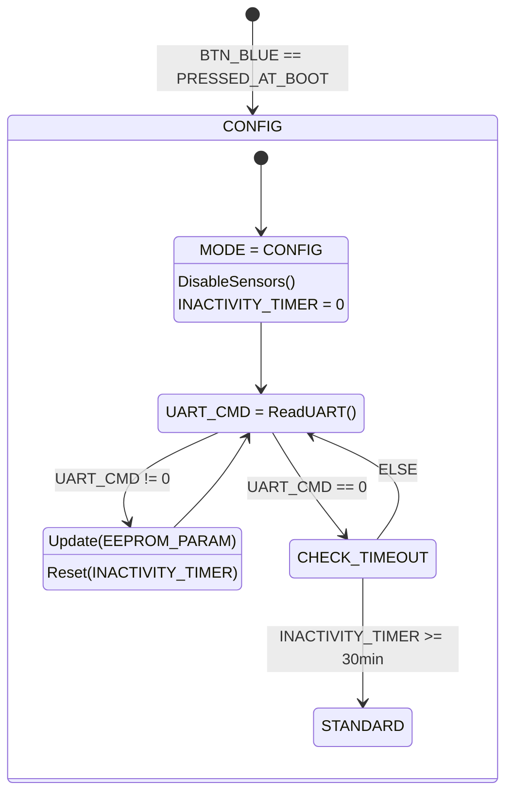
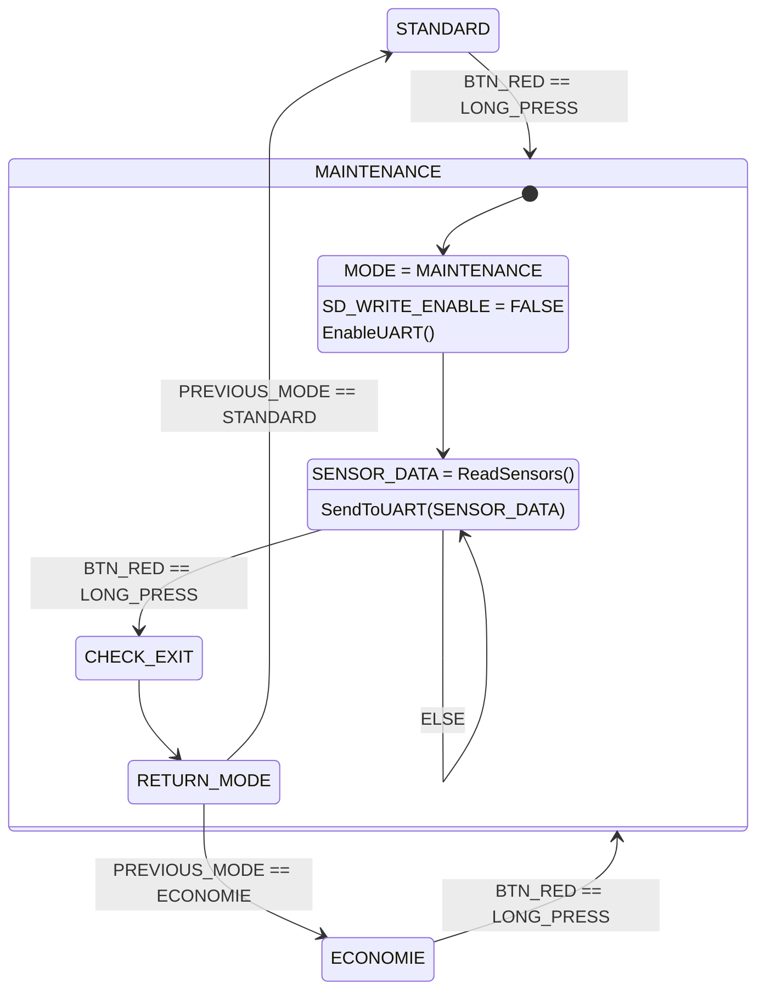
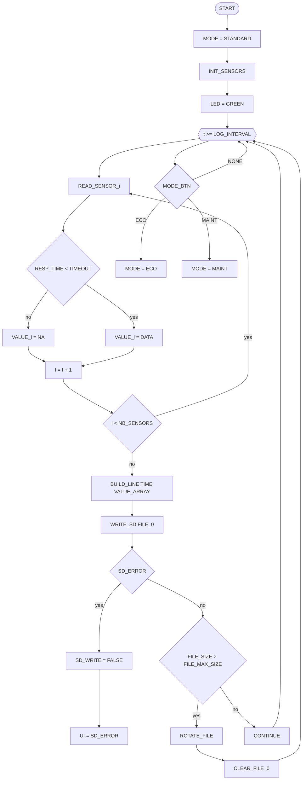
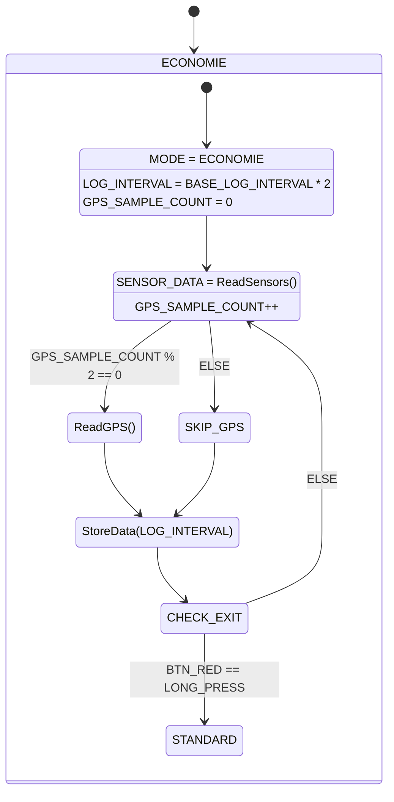

## Station Météo – Projet S3E - Livrable 2 - REVEILLON Martin - PHILIPPE Mathéo - RIVIERE Léo - GANITTA Ylan

## Présentation du projet
L'Agence Internationale pour la Vigilance Météorologique (AIVM) se lance dans un projet ambitieux : déployer dans les océans des navires de surveillance équipés de stations météo embarquées chargées de mesurer les paramètres influant sur la formation de cyclones ou autres catastrophes naturelles.

Un grand nombre de sociétés utilisant des transports navals ont accepté d'équiper leurs bateaux avec ces stations embarquées. En revanche, ces dernières devront être simples et efficaces et pilotables par un des membres de l'équipage (une documentation technique utilisateur sera mise à disposition).


---

## Objectifs
-Comprendre le fonctionnement de la station

-Réaliser la structure du code

---
## Contenu du document : Ce document contient les diagrammes de fonctionnement des 4 modes de la station et la tructure du code commentée.
---

## Diagrammes détaillants le fonctionnement du système (les commentaires des diagrammes sont dans "code") : 
## Mode Configuration

### Description

Au démarrage, si le bouton bleu est maintenu appuyé, le système entre en **mode CONFIGURATION**.
Ce mode permet de modifier les paramètres via la liaison série (UART).
Les capteurs sont désactivés pour éviter toute acquisition pendant la configuration.

### Variables

* `MODE` : variable globale indiquant le mode courant du système.
* `INACTIVITY_TIMER` : compteur mesurant la durée sans activité UART.
* `EEPROM_PARAM` : structure contenant les paramètres système stockés en mémoire non volatile.
* `UART_CMD` : variable contenant la commande reçue via la liaison série.

### Fonctions

* `DisableSensors()`
  Désactive l’acquisition des capteurs.

* `ReadUART()`
  Lit une commande reçue sur l’interface série.
  Retourne `0` si aucune commande n’est disponible.

* `Update(EEPROM_PARAM)`
  Met à jour les paramètres système en mémoire EEPROM.

* `Reset(INACTIVITY_TIMER)`
  Remet le compteur d’inactivité à zéro.

### Fonctionnement

Le système attend des commandes UART en boucle.
Chaque commande reçue :

* met à jour les paramètres,
* remet à zéro le timer d’inactivité.

Si aucune activité n’est détectée pendant 30 minutes, le système quitte automatiquement le mode CONFIGURATION et retourne en mode STANDARD.



```mermaid
stateDiagram-v2

    [*] --> CONFIG : BTN_BLUE == PRESSED_AT_BOOT
    %% Si le bouton bleu est pressé démarrage du mode configuration

    state CONFIG {

        [*] --> INIT_CONFIG

        INIT_CONFIG : MODE = CONFIG
        INIT_CONFIG : DisableSensors()
        INIT_CONFIG : INACTIVITY_TIMER = 0
        %% On désactive l'acquisition
        %% On initialise le timer d'inactivité

        INIT_CONFIG --> WAIT_CMD

        %% ATTENTE DE COMMANDE UART

        WAIT_CMD : UART_CMD = ReadUART()
        %% Lecture d'une commande depuis la console série

        WAIT_CMD --> PROCESS_CMD : UART_CMD != 0
        %% Si une commande est reçue

        WAIT_CMD --> CHECK_TIMEOUT : UART_CMD == 0
        %% Sinon, on vérifie le timer d'inactivité

        %% TRAITEMENT DES COMMANDES

        PROCESS_CMD : Update(EEPROM_PARAM)
        PROCESS_CMD : Reset(INACTIVITY_TIMER)
        %% Mise à jour des paramètres système
        %% Remise à zéro du timer

        PROCESS_CMD --> WAIT_CMD
        %% Retour en attente d'une nouvelle commande

        %% GESTION DU TIMEOUT

        CHECK_TIMEOUT --> STANDARD : INACTIVITY_TIMER >= 30min
        %% Si aucune activité pendant 30 minutes, retour automatique au mode standard

        CHECK_TIMEOUT --> WAIT_CMD : ELSE
        %% Sinon on continue à attendre une commande
    }
```
## Mode Maintenance

### Description

Accessible depuis les modes STANDARD ou ECONOMIE via un appui long sur le bouton rouge.

Ce mode permet :

* de continuer l’acquisition des capteurs,
* d’envoyer les données en temps réel via l’UART,
* de désactiver l’enregistrement sur carte SD.

### Variables

* `MODE` : mode courant.
* `PREVIOUS_MODE` : mode actif avant l’entrée en maintenance.
* `SD_WRITE_ENABLE` : booléen autorisant ou non l’écriture sur la carte SD.
* `SENSOR_DATA` : structure contenant les données capteurs lues.

### Fonctions

* `EnableUART()`
  Active l’interface série.

* `ReadSensors()`
  Lit l’ensemble des capteurs et retourne les valeurs mesurées.

* `SendToUART(SENSOR_DATA)`
  Transmet les données capteurs sur la liaison série.

### Fonctionnement

À l’entrée :

* l’écriture SD est désactivée,
* l’UART est activée.

Les capteurs continuent d’être lus en continu.
Les données sont envoyées en temps réel sur la liaison série.

Un nouvel appui long sur le bouton rouge permet de quitter le mode MAINTENANCE et de revenir au mode actif précédent (STANDARD ou ECONOMIE).


```mermaid
stateDiagram-v2

    STANDARD --> MAINTENANCE : BTN_RED == LONG_PRESS
    ECONOMIE --> MAINTENANCE : BTN_RED == LONG_PRESS
    %% Appui long sur bouton rouge
    %% permet d'entrer en mode maintenance

    %% MODE MAINTENANCE

    state MAINTENANCE {

        [*] --> INIT_MAINT

        INIT_MAINT : MODE = MAINTENANCE
        INIT_MAINT : SD_WRITE_ENABLE = FALSE
        INIT_MAINT : EnableUART()
        %% Désactivation de l'enregistrement sur le carte SD
        %% Activation interface série
        INIT_MAINT --> RUN_MAINT

        RUN_MAINT : SENSOR_DATA = ReadSensors()
        RUN_MAINT : SendToUART(SENSOR_DATA)
        %% Acquisition toujours active
        %% Données envoyées en temps réel sur UART

        RUN_MAINT --> CHECK_EXIT : BTN_RED == LONG_PRESS
        RUN_MAINT --> RUN_MAINT : ELSE


        CHECK_EXIT --> RETURN_MODE
    }

    %% RETOUR AU MODE PRECEDENT

    RETURN_MODE --> STANDARD : PREVIOUS_MODE == STANDARD
    RETURN_MODE --> ECONOMIE : PREVIOUS_MODE == ECONOMIE
    %% Retour au mode actif avant maintenance

```
## Mode Standard

### Description

Mode de fonctionnement normal du système.
Les capteurs sont lus périodiquement et les données sont enregistrées sur carte SD.

### Variables

* `LOG_INTERVAL` : intervalle de temps entre deux enregistrements (ex : 10 minutes).
* `NB_SENSORS` : nombre total de capteurs.
* `I` : index du capteur en cours de lecture.
* `TIMEOUT` : temps maximal autorisé pour la réponse d’un capteur.
* `RESP_TIME` : temps réel de réponse du capteur.
* `VALUE_i` : valeur lue pour le capteur i.
* `VALUE_ARRAY` : tableau contenant toutes les valeurs capteurs.
* `FILE_0` : fichier courant d’enregistrement.
* `FILE_MAX_SIZE` : taille maximale autorisée pour un fichier.
* `SD_ERROR` : indicateur d’erreur d’écriture SD.

### Fonctions

* `INIT_SENSORS()`
  Initialise tous les capteurs.

* `READ_SENSOR_i()`
  Lit le capteur d’index `i`.

* `BUILD_LINE(TIME, VALUE_ARRAY)`
  Construit une ligne horodatée contenant toutes les valeurs capteurs.

* `WRITE_SD(FILE_0)`
  Écrit la ligne dans le fichier courant sur la carte SD.

* `ROTATE_FILE()`
  Crée un nouveau fichier lorsque la taille maximale est atteinte.

* `CLEAR_FILE_0()`
  Réinitialise le fichier courant après rotation.

### Fonctionnement

1. Initialisation des capteurs.
2. LED verte activée.
3. Boucle principale déclenchée toutes les `LOG_INTERVAL`.

À chaque cycle :

* lecture de chaque capteur avec gestion du timeout,
* remplacement par `NA` si absence de réponse,
* construction d’une ligne horodatée,
* écriture sur carte SD.

En cas d’erreur SD :

* arrêt de l’écriture,
* signalement d’erreur à l’utilisateur.

Si le fichier dépasse `FILE_MAX_SIZE`, une rotation de fichier est effectuée.

Le bouton de mode permet à tout moment de passer en ECO ou MAINTENANCE.


```mermaid


%% MODE STANDARD

%% Ce diagramme initialise les capteurs et interface, puis toutes les 10 secondes lit chaque capteur avec un timeout, il construit une ligne horodatée, l’écrit sur la carte SD avec gestion d’erreurs, effectue une rotation de fichier si nécessaire, tout en permettant à l’utilisateur de changer de mode (Standard/Eco/Maintenance).

flowchart TD
    %% on initialise 
    START([START])

    %% on rentre en mode standard
    START --> MODE[MODE = STANDARD]

    %% Initialisation des capteurs
    MODE --> INIT[INIT_SENSORS]

    %% Indication avec la led du fonctionnement normal
    INIT --> LED[LED = GREEN]

    %% Pour la BOUCLE PRINCIPALE
    %% Déclenchement périodique selon LOG_INTERVAL de 10min
    LED --> LOOP{{t >= LOG_INTERVAL}}

    %% Lecture du capteur i
    LOOP --> READ[READ_SENSOR_i]

    %% on vérifie le temps de réponse
    READ --> RESP{RESP_TIME < TIMEOUT}

    %% Si le capteur ne répond pas
    RESP -- no --> SET_NA[VALUE_i = NA]

    %% Si le capteur répond bien
    RESP -- yes --> SET_VAL[VALUE_i = DATA]

    %% on passe au capteur suivant
    SET_NA --> NEXT[I = I + 1]
    SET_VAL --> NEXT

    %% Vérification s’il reste des capteurs à lire
    NEXT --> CHECK_I{I < NB_SENSORS}

    %% on continue la lecture des capteurs
    CHECK_I -- yes --> READ

    %% tous les capteurs ont été lus
    CHECK_I -- no --> LINE[BUILD_LINE TIME VALUE_ARRAY]

    %% ÉCRITURE SUR CARTE SD
    %% Écriture dans le fichier de révision 0
    LINE --> WRITE[WRITE_SD FILE_0]

    %% Vérification si il y a des erreur d’écriture
    WRITE --> ERR_SD{SD_ERROR}

    %% En cas d’erreur SD
    ERR_SD -- yes --> STOP[SD_WRITE = FALSE]
    STOP --> ERR_MSG[UI = SD_ERROR]

    %% Si pas d’erreur SD
    ERR_SD -- no --> SIZE{FILE_SIZE > FILE_MAX_SIZE}

    %% Si le fichier dépasse la taille max
    SIZE -- yes --> ROTATE[ROTATE_FILE]
    ROTATE --> RESET[CLEAR_FILE_0]

    %% Sinon on continue l’écriture normale
    SIZE -- no --> CONTINUE

    RESET --> LOOP
    CONTINUE --> LOOP

    %%  CHANGEMENT DE MODE
    %% on regarde le bouton de mode
    LOOP --> BTN{MODE_BTN}

    %% Passage en mode économique
    BTN -- ECO --> ECO[MODE = ECO]

    %% Passage en mode maintenance
    BTN -- MAINT --> MAINT[MODE = MAINT]

    %% Pas de changement de mode
    BTN -- NONE --> LOOP
```
## Mode Economique 

### Description

Mode basse consommation activé depuis STANDARD.

Les objectifs :

* réduire la fréquence d’enregistrement,
* limiter l’utilisation du GPS,
* diminuer la consommation énergétique globale.

### Variables

* `LOG_INTERVAL` : intervalle d’enregistrement (doublé par rapport au mode STANDARD).
* `BASE_LOG_INTERVAL` : intervalle standard de référence.
* `GPS_SAMPLE_COUNT` : compteur permettant de ne lire le GPS qu’une fois sur deux cycles.
* `SENSOR_DATA` : structure contenant les données mesurées.

### Fonctions

* `ReadSensors()`
  Lit les capteurs principaux.

* `ReadGPS()`
  Lit les données GPS.

* `StoreData(LOG_INTERVAL)`
  Stocke les données selon l’intervalle défini.

### Fonctionnement

À l’entrée :

* `LOG_INTERVAL` est multiplié par 2,
* le compteur GPS est remis à zéro.

À chaque cycle :

* lecture des capteurs,
* incrémentation du compteur GPS,
* lecture du GPS uniquement si le compteur est pair,
* stockage des données.

Le système reste dans cette boucle jusqu’à un appui long sur le bouton rouge, qui provoque le retour en mode STANDARD.


```mermaid
stateDiagram-v2

    %% ACTIVATION DU MODE ECONOMIE

    [*] --> ECONOMIE
    %% Le système entre en mode économie
    %% depuis le mode STANDARD (appui long bouton blanc)

    state ECONOMIE {

        [*] --> INIT_ECO

        INIT_ECO : MODE = ECONOMIE
        INIT_ECO : LOG_INTERVAL = BASE_LOG_INTERVAL * 2
        INIT_ECO : GPS_SAMPLE_COUNT = 0
        %% On passe en mode économie
        %% L’intervalle d’enregistrement est doublé
        %% Le compteur GPS est initialisé à 0

        INIT_ECO --> RUN_ECO
        RUN_ECO : SENSOR_DATA = ReadSensors()
        RUN_ECO : GPS_SAMPLE_COUNT++
        %% Lecture des capteurs
        %% Incrémentation du compteur GPS (1 mesure sur 2)

       
        RUN_ECO --> READ_GPS : GPS_SAMPLE_COUNT % 2 == 0
        %% Si le compteur est pair on lit le GPS

        RUN_ECO --> SKIP_GPS : ELSE
        %% Sinonon ignore la lecture GPS

        READ_GPS : ReadGPS()
        READ_GPS --> STORE_DATA

        SKIP_GPS --> STORE_DATA

        STORE_DATA : StoreData(LOG_INTERVAL)
        %% Stockage des données

        STORE_DATA --> CHECK_EXIT

  

        CHECK_EXIT --> STANDARD : BTN_RED == LONG_PRESS
        %% Appui long bouton rouge
        %% Retour au mode STANDARD

        CHECK_EXIT --> RUN_ECO : ELSE
        %% Sinon, la boucle continue
    }


```
---

## Structure générale du programme : 

<1> Déclarations globales
```ccp
// -------------------------------------------------------------
// Bibliothèques nécessaires (abstraction des modules matériels)
// -------------------------------------------------------------
IMPORT EEPROM
IMPORT RTC
IMPORT I2C
IMPORT GPS
IMPORT SD
IMPORT Capteur_Temp_Hum
IMPORT LCD_RGB
IMPORT LED_RGB
IMPORT Capteur_Luminosite

// -------------------------------------------------------------
// Définition des modes de fonctionnement
// -------------------------------------------------------------
ENUM Mode = { STANDARD, CONFIG, MAINTENANCE, ECO }
VARIABLE actualMod
VARIABLE lastMod

// -------------------------------------------------------------
// Paramètres liés aux capteurs
// -------------------------------------------------------------
CONSTANTE NB_CAPTEURS = 3
CONSTANTE NB_VAL = 10

STRUCTURE Capteur
    Tableau moy_gliss[NB_VAL]
    Entier nb_erreur
FIN STRUCTURE

TABLEAU capteurs[NB_CAPTEURS]
VARIABLE ind_moy = 0

// -------------------------------------------------------------
// Paramètres système sauvegardés
// -------------------------------------------------------------
STRUCTURE ConfigParams
    LOG_INTERVAL
    FILE_MAX_SIZE
    TIMEOUT
    LUMIN_LOW
    LUMIN_HIGH
    MIN_TEMP_AIR
    MAX_TEMP_AIR
FIN STRUCTURE

VARIABLE config

// -------------------------------------------------------------
// Gestion du stockage SD
// -------------------------------------------------------------
VARIABLE myFile
VARIABLE nomFichier

// -------------------------------------------------------------
// Prototype : vérification des limites d’une valeur capteur
// -------------------------------------------------------------
FONCTION checkLimits(value, minVal, maxVal)
```
Commentaire :
Cette section définit la structure globale du système : les modules matériels utilisés, les modes de fonctionnement, les structures de données pour les capteurs et les paramètres configurables. Elle prépare également les variables nécessaires à la gestion du stockage et à la validation des mesures.

<2> Initialisation (setup)

```ccp
// -------------------------------------------------------------
// Procédure d'initialisation au démarrage
// -------------------------------------------------------------
PROCÉDURE setup()

    INITIALISER LED_RGB
    INITIALISER Boutons
    INITIALISER Capteurs
    INITIALISER GPS
    INITIALISER RTC
    INITIALISER Carte_SD

    CHARGER config DEPUIS EEPROM

    actualMod ← STANDARD
    METTRE_A_JOUR LED_SELON(actualMod)

FIN PROCÉDURE
```
Commentaire :
Cette procédure est exécutée une seule fois au démarrage. Elle initialise tous les modules matériels et charge la configuration sauvegardée. Le système démarre en mode STANDARD.

<3> Changement de modes (loop)
```ccp
// -------------------------------------------------------------
// Boucle principale : gestion des modes
// -------------------------------------------------------------
PROCÉDURE loop()

    ANALYSER Boutons

    SELON actualMod FAIRE

        CAS STANDARD :
            collectData(config.LOG_INTERVAL)

        CAS CONFIG :
            TRAITER Commandes_Série

        CAS MAINTENANCE :
            AFFICHER Données_Directes

        CAS ECO :
            collectData(config.LOG_INTERVAL × 2)

    FIN SELON

FIN PROCÉDURE
```
Commentaire :
La boucle principale implémente la machine à états. En fonction du mode actif, le comportement du système change dynamiquement.

<4> Lecture des capteurs (avec pointeurs)
```ccp
// -------------------------------------------------------------
// Lecture générique de l’ensemble des capteurs
// -------------------------------------------------------------
PROCÉDURE Lecture(tab_val, erreurs)

    POUR i DE 0 À NB_CAPTEURS - 1 FAIRE

        mesure ← LIRE_Capteur(i)

        SI erreur DÉTECTÉE ALORS
            erreurs[i] ← erreurs[i] + 1
        SINON
            Add_Val(tab_val, mesure)
        FIN SI

    FIN POUR

FIN PROCÉDURE
```
Commentaire :
Cette procédure centralise la lecture des capteurs. En cas d’erreur, un compteur est incrémenté. Sinon, la valeur valide est ajoutée dans la mémoire de moyenne glissante.

<5> Moyenne glissante
```ccp
// -------------------------------------------------------------
// Gestion du tampon circulaire pour moyenne glissante
// -------------------------------------------------------------
PROCÉDURE Add_Val(tab_moy, val)

    tab_moy[ind_moy] ← val

    SI ind_moy ≥ NB_VAL - 1 ALORS
        ind_moy ← 0
    SINON
        ind_moy ← ind_moy + 1
    FIN SI

FIN PROCÉDURE
```
Commentaire :
Les mesures sont stockées dans un tableau circulaire afin de lisser les variations et conserver uniquement les valeurs récentes.

<6> Vérification des limites : checkLimits()
```ccp
// -------------------------------------------------------------
// Validation d’une mesure selon les seuils définis
// -------------------------------------------------------------
FONCTION checkLimits(value, minVal, maxVal)

    SI value est INVALIDE ALORS
        RETOURNER "NA"

    SI value < minVal OU value > maxVal ALORS
        RETOURNER "Valeur Hors-Limite"

    RETOURNER value_convertie_en_texte

FIN FONCTION
```
Commentaire :
Cette fonction garantit que seules les valeurs cohérentes sont exploitées. Elle filtre les capteurs non répondants et les mesures hors intervalle.

<7> Collecte + enregistrement SD
```ccp
// -------------------------------------------------------------
// Acquisition des données et stockage périodique
// -------------------------------------------------------------
PROCÉDURE collectData(interval)

    SI Temps_Écoulé ≥ interval ALORS

        temp ← Lire_Température()
        hum  ← Lire_Humidité()
        lum  ← Lire_Luminosité()
        gps  ← Lire_GPS()

        tempStr ← checkLimits(temp, MIN_TEMP_AIR, MAX_TEMP_AIR)
        humStr  ← checkLimits(hum, 0, 100)
        lumStr  ← checkLimits(lum, LUMIN_LOW, LUMIN_HIGH)

        ÉCRIRE tempStr, humStr, lumStr, gps SUR Carte_SD

        METTRE_À_JOUR Timer

    FIN SI

FIN PROCÉDURE
```
Commentaire :
Cette procédure constitue le cœur fonctionnel du système. Elle réalise l’acquisition des données, vérifie leur validité, puis les enregistre sur la carte SD à intervalles réguliers.

