# 🌦️ Station Météo – Projet Arduino / Grove

## Présentation du projet
L'Agence Internationale pour la Vigilance Météorologique (AIVM) se lance dans un projet ambitieux : déployer dans les océans des navires de surveillance équipés de stations météo embarquées chargées de mesurer les paramètres influant sur la formation de cyclones ou autres catastrophes naturelles.

Un grand nombre de sociétés utilisant des transports navals ont accepté d'équiper leurs bateaux avec ces stations embarquées. En revanche, ces dernières devront être simples et efficaces et pilotables par un des membres de l'équipage (une documentation technique utilisateur sera mise à disposition).

---

## Objectifs
- Acquérir et horodater des données environnementales
- Enregistrer les données sur carte SD
- Permettre la configuration via interface série
- Assurer un fonctionnement robuste et autonome

---

## Architecture générale du système

```mermaid
flowchart TD

    Start([Démarrage du système])

    Start --> D0{Bouton rouge pressé au démarrage ?}
    D0 -- Oui --> Configuration
    D0 -- Non --> Standard

    Standard["Mode STANDARD activé"]

    Standard --> D1{Bouton vert 5s ?}
    D1 -- Oui --> Economique
    D1 -- Non --> D2{Bouton rouge 5s ?}
    D2 -- Oui --> Maintenance_S
    D2 -- Non --> Standard

    Configuration["Mode CONFIGURATION activé (Acquisition désactivée)"]

    Configuration --> D3{30 min sans activité ?}
    D3 -- Oui --> Standard
    D3 -- Non --> Configuration

    Economique["Mode ECONOMIQUE activé (Capteurs partiellement désactivés)"]

    Economique --> D4{Bouton rouge 5s ?}
    D4 -- Oui --> Standard
    D4 -- Non --> D5{Bouton rouge pressé ?}
    D5 -- Oui --> Maintenance_E
    D5 -- Non --> Economique

    Maintenance_S["Mode MAINTENANCE activé (depuis STANDARD)"]
    Maintenance_E["Mode MAINTENANCE activé (depuis ECONOMIQUE)"]

    Maintenance_S --> D6{Bouton rouge 5s ?}
    D6 -- Oui --> Standard
    D6 -- Non --> Maintenance_S

    Maintenance_E --> D7{Bouton rouge 5s ?}
    D7 -- Oui --> Economique
    D7 -- Non --> Maintenance_E
```

##Mode de fonctionnement : Changement de LED 

```mermaid
flowchart TD

    Start([Système en fonctionnement])

    Start --> Mode{Mode actif ?}

    Mode -->|Standard| LED_Standard[LED verte continue]
    Mode -->|Configuration| LED_Config[LED jaune continue]
    Mode -->|Economique| LED_Eco[LED bleue continue]
    Mode -->|Maintenance| LED_Maint[LED orange continue]

    Start --> Erreur{Erreur détectée ?}

    Erreur -->|RTC| LED_RTC[LED rouge/bleue clignotante 1Hz]
    Erreur -->|GPS| LED_GPS[LED rouge/jaune clignotante 1Hz]
    Erreur -->|Capteur| LED_CAPT[LED rouge/verte clignotante 1Hz]
    Erreur -->|Données incohérentes| LED_INCOH[LED rouge/verte vert plus long]
    Erreur -->|SD pleine| LED_SD_FULL[LED rouge/blanche clignotante 1Hz]
    Erreur -->|Erreur SD| LED_SD_ERR[LED rouge/blanche blanc plus long]
```

