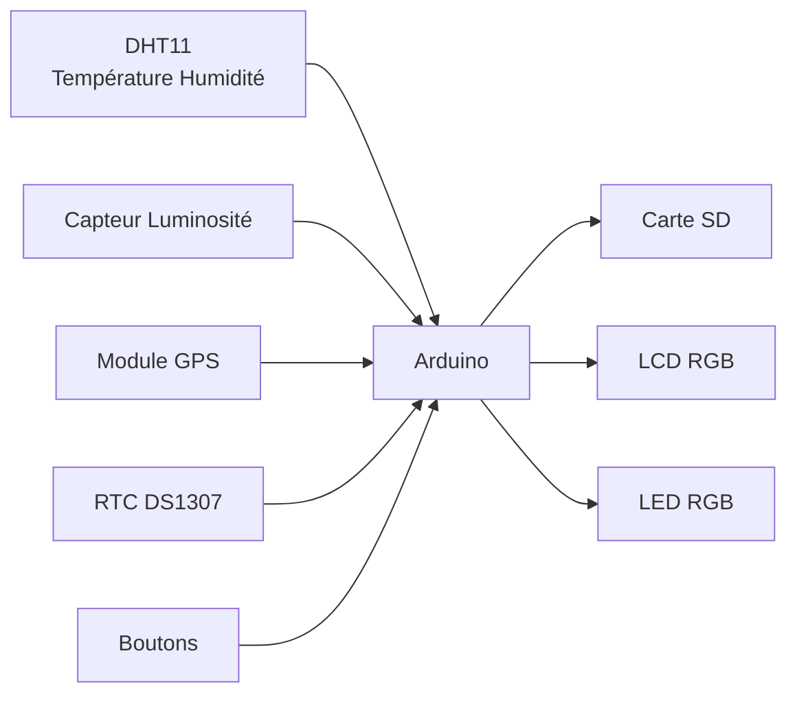
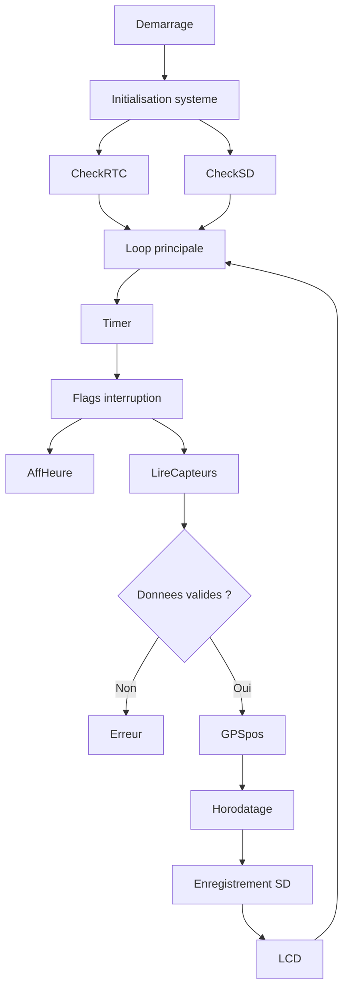
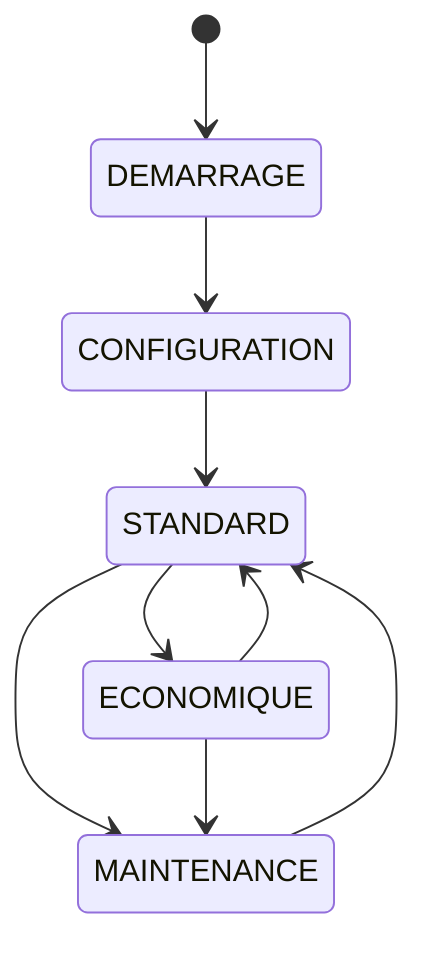

# Architecture du système

## Vue globale du système

Le projet implémente une **station de mesure environnementale embarquée** basée sur un microcontrôleur Arduino.
Le système collecte périodiquement plusieurs données environnementales, les horodate et les enregistre dans un fichier CSV sur une carte SD.

Les principales fonctionnalités sont :

* acquisition de **température et humidité**
* mesure de **luminosité**
* récupération de la **position GPS**
* horodatage via **RTC**
* stockage des données sur **carte SD**
* affichage sur **écran LCD**
* gestion de plusieurs **modes de fonctionnement**

---

# 1. Architecture matérielle

## Diagramme d’architecture



---

## Explication du diagramme

Ce diagramme représente l’**architecture matérielle du système**.

Le **microcontrôleur Arduino** est le cœur du système. Il coordonne toutes les interactions entre les capteurs, les périphériques d'affichage et les modules de stockage.

### Capteurs

Trois capteurs fournissent les données environnementales :

**DHT11**

* mesure la température de l’air
* mesure l’humidité relative

**Capteur de luminosité**

* connecté sur une entrée analogique
* fournit une valeur entre **0 et 1023**

**GPS**

* communique via **liaison série**
* fournit latitude et longitude

---

### Modules système

**RTC DS1307**

* horloge temps réel
* fournit la date et l’heure
* utilisé pour horodater les mesures

**Carte SD**

* stockage permanent des mesures
* format CSV

---

### Interfaces utilisateur

**LCD RGB**

affiche :

* le mode du système
* l’heure
* l’état GPS
* les erreurs

**LED RGB**

indique visuellement :

* le mode actif
* les erreurs

**Boutons**

permettent de :

* changer le mode du système
* accéder à la configuration

---

# 2. Flux d'information du système

## Diagramme de fonctionnement



---

## Explication du fonctionnement

Le système suit un **cycle de fonctionnement périodique**.

### 1 Initialisation

Lors du démarrage (`setup()`), le programme initialise :

* le port série
* le capteur DHT
* la communication I2C
* le module GPS
* l’écran LCD
* la carte SD
* le RTC
* le timer d'interruption

---

### 2 Boucle principale

La fonction `loop()` est le cœur du programme.

Elle exécute en continu :

* gestion des boutons
* configuration série
* décodage GPS
* vérification des erreurs
* traitement des flags d’interruption

---

### 3 Gestion du timer

Le **Timer1** génère une interruption toutes les **1 seconde**.

Cette interruption active deux flags :

```
flagHorloge
flagCapteurs
```

Ces flags déclenchent :

* l’affichage de l’heure
* la lecture des capteurs

Cette approche évite de bloquer la boucle principale.

---

### 4 Lecture des capteurs

Les capteurs mesurent :

* température
* humidité
* luminosité

Les valeurs sont ensuite **vérifiées** :

* cohérence
* limites configurées

Si une incohérence est détectée :

* affichage d’erreur
* clignotement de la LED

---

### 5 Acquisition GPS

Si le GPS fournit des coordonnées valides :

* latitude
* longitude

elles sont ajoutées à la mesure.

Sinon la valeur **NA** est enregistrée.

---

### 6 Enregistrement des données

Les données sont stockées dans :

```
donnees.csv
```

Format :

```
date heure;temperature;humidite;luminosite;latitude;longitude
```

Exemple :

```
2026-03-01 14:22:03;22.4;45.2;512;43.604652;1.444209
```

---

# 3. Machine d’état des modes

Le système fonctionne selon **plusieurs modes opérationnels**.

## Diagramme des modes



---

## Explication des modes

### Mode DEMARRAGE

Mode actif au lancement du système.

Fonctions :

* initialisation du matériel
* vérification RTC et SD

---

### Mode CONFIGURATION

Les capteurs sont désactivés, tout comme l'enregistrement SD.
Permet de modifier les paramètres via le **port série**.

Exemples :

```
LOG_INTERVAL=10
MIN_TEMP_AIR=0
MAX_TEMP_AIR=35
RESET
VERSION
```

Les paramètres sont stockés dans **EEPROM**.

---

### Mode STANDARD

Mode normal de fonctionnement.

* lecture capteurs
* enregistrement sur SD
* fréquence normale

Intervalle :

```
LOG_INTERVAL secondes
```

---

### Mode ECONOMIQUE

Mode basse consommation.

Fonctionnement identique au mode standard mais :

```
intervalle = LOG_INTERVAL × 2
```

---

### Mode MAINTENANCE

Utilisé pour :

* diagnostic
* tests
* maintenance système

Les données ne sont pas enregistrées.

---

## Explication changement de mode

Après initialisation, la station sera en mode DEMARRAGE, en appuyant sur l'un des deux boutons on passe en mode CONFIGURATION, appuyer sur un des deux boutons permet de passer en mode STANDARD, depuis ce mode on peut passer en mode ECO ou en mode MAINTENANCE, depuis ces deux modes il est possible d'accéder à l'autre ou de repasser en mode standard en rappuyant sur le même bouton que pour activer.

# 4. Architecture du code

Le programme est structuré en plusieurs blocs fonctionnels.

```
Programme Arduino
│
├── Setup
│   ├── Initialisation matériel
│   ├── Initialisation RTC
│   ├── Initialisation SD
│   ├── Initialisation capteurs
│   └── Configuration Timer
│
├── Loop principale
│   ├── gestion boutons
│   ├── configuration série
│   ├── décodage GPS
│   ├── affichage heure
│   └── lecture capteurs
│
├── Gestion capteurs
│   ├── DHT11
│   ├── luminosité
│   └── GPS
│
├── Gestion stockage
│   ├── ouverture SD
│   ├── écriture CSV
│   └── vérification mémoire
│
├── Gestion interface
│   ├── LCD
│   ├── LED RGB
│   └── boutons
│
└── Gestion interruptions
    └── Timer1 (1 Hz)
```

---

# 5. Gestion des erreurs

Le système implémente plusieurs mécanismes de sécurité.

## RTC déconnecté

Affichage :

```
RTC erreur
```

La LED clignote en **bleu/rouge**.

---

## Carte SD absente

Affichage :

```
SD absente
```

Les données ne peuvent pas être enregistrées.

---

## Carte SD pleine

Affichage :

```
SD pleine
```

L’enregistrement est stoppé.

---

## Erreur capteur

Détectée si :

* valeur incohérente
* capteur saturé
* données invalides

Signalisation :

* message LCD
* LED rouge/verte clignotante

---

# 6. Stockage des paramètres

Certains paramètres sont sauvegardés en **EEPROM**.

Exemple :

```
LOG_INTERVAL
```

Adresse mémoire :

```
EEPROM_ADDR_LOG_INTERVAL
```

Cela permet de conserver la configuration après redémarrage.


# 7. Explication du code 

## Bibilothèques 

```
#include <Arduino.h>
#include <Wire.h>
#include <RTClib.h>
#include <ChainableLED.h>
#include "rgb_lcd.h"
#include <SoftwareSerial.h>
#include <DHT.h>
#include <TinyGPS.h>
#include <SD.h>
#include <avr/interrupt.h>
#include <EEPROM.h>
```

Afin de pouvoir utiliser les capteurs, le LCD, le GPS, le lecteur SD ainsi que d'autres fonctionnalités, nous avons besoins de biblothèques.

## Constantes
```
#define BUTTON_RED 7
#define BUTTON_GREEN 6
#define LED_DATA_PIN 4
#define LED_CLOCK_PIN 5
#define GPS_RX 8
#define GPS_TX 3
#define DHTPIN 2
#define LIGHT_SENSOR A0
#define SD_CS 10
```

Cette partie correspond à la broche à laquelle le composant est branché.

```
#define DHTTYPE DHT11
```

Indique que le capteur est un DHT11. 

```
#define DEBOUNCE_MS 200
#define DEFAULT_LOG_INTERVAL 5
```

Donne le temps anti-rebond pour les boutons, et le temps entre deux enregistrements de données.

## EEPROM

```
#define EEPROM_ADDR_LOG_INTERVAL 0
```

Indique que l’adresse mémoire EEPROM où sera stocké l’intervalle de log est l’adresse 0. L’EEPROM de l’Arduino est une petite mémoire non volatile (elle garde les données même après coupure de courant). Ici on l'utilise pour pouvoir garder notre temps entre deux enregistrements après l'avoir changer avec la commande LOG_INTERVAL.

## Objets 

```
ChainableLED leds(LED_DATA_PIN, LED_CLOCK_PIN, 1);
rgb_lcd lcd;
RTC_DS1307 rtc;
SoftwareSerial gpsSerial(GPS_RX, GPS_TX);
DHT dht(DHTPIN, DHTTYPE);
TinyGPS gps;
```

C'est l'interface entre le code et le physique.

## Paramètre 

```
unsigned int LOG_INTERVAL = DEFAULT_LOG_INTERVAL;
```

C'est l'interval entre deux enregistrements (en secondes).

## Seuils capteurs

```
int MIN_TEMP_AIR = -5;
int MAX_TEMP_AIR = 30;

int HYGR_MIN = 0;
int HYGR_MAX = 100;

int MIN_LUMIN = 0;
int MAX_LUMIN = 1023;
```

C'est les valeurs de seuil par défaut pour les données incohérentes.

## Etats 

```
bool sdOK = true;
bool rtcOK = true;
bool rtcMessageShown = false;
bool sdFull = false;
```

Ce sont les flags d'états.

## Modes

```
enum Mode { DEMARRAGE, CONFIGURATION, STANDARD, ECONOMIQUE, MAINTENANCE };
volatile Mode modeActuel = DEMARRAGE;
```

On définit ici une machine à états.

## Interruptions 

```
volatile bool flagHorloge = false;
volatile bool flagCapteurs = false;
```

Ce sont des flags d'interruptions

## Boutons

```
unsigned long lastRedPress = 0;
unsigned long lastGreenPress = 0;
bool redPressed = false;
bool greenPressed = false;
```

Anti-rebond des boutons et états logiques des boutons.

## Progmem

```
const char STR_DEMARRAGE[]     PROGMEM = "Mode Demarrage";
const char STR_CONFIG[]        PROGMEM = "Mode Config";
const char STR_STANDARD[]      PROGMEM = "Mode Standard";
const char STR_ECO[]           PROGMEM = "Mode Eco";
const char STR_MAINT[]         PROGMEM = "Maintenance";
const char STR_INIT[]          PROGMEM = "Initialisation";
const char STR_RTC_ERROR[]     PROGMEM = "RTC erreur";
const char STR_ERR_CAPTEUR[]   PROGMEM = "erreur capteur";
const char STR_SD_ABSENTE[]    PROGMEM = "SD absente !";
const char STR_SD_PLEINE[]     PROGMEM = "SD pleine !";
```

On stock sur la mémoire flash, ce qui : économise la RAM (crucial sur Arduino), centralise les messages, facilite la localisation ou la maintenance.

## Version 

```
const char PROGRAM_VERSION[] PROGMEM = "1.0.0";
const char PROGRAM_LOT[]     PROGMEM = "26030101";
```

Le numéro de version et de lot, accessible grâce à la commande VERSION.

## SD

```
const char FICHIER_CSV[] PROGMEM = "donnees.csv";
const uint32_t SD_MAX_SIZE = 2684354560UL;
```

Nom du fichier csv "DONNEES", et limite de stockage (définit à 25GO) afin d'éviter d'enregistrer sur une carte pleine.

## Prototype 

```
void configTimer1();
void changerMode(Mode m,uint8_t r,uint8_t g,uint8_t b,const char* texte);
void lireCapteurs();
void afficherHeure();
void gererBoutons();
void afficherTexteLCD(const char* textePROGMEM);
void enregistrerDonnees(float t,float h,int lum,bool gpsOK,float lat,float lon,
                        int annee,int mois,int jour,int heure,int minute,int seconde);
void fermerSD();
bool ouvrirSD();
bool sdPleine();
void clignoterErreur(uint8_t r1,uint8_t g1,uint8_t b1,
                     uint8_t r2,uint8_t g2,uint8_t b2,
                     unsigned long interval);
void clignoterErreurIncoherence();
bool testerRTC();
void reafficherMode();
void clignoterGPS();
void gererConfigurationSerie();
```

Ces lignes déclarent toutes les fonctions que le programme utilise. Les fonctions apparaissent ici sous forme de prototypes, ce qui permet au compilateur de connaître leur existence avant leur définition.

## Interruptions

```
ISR(TIMER1_COMPA_vect)
{
    flagHorloge = true;
    flagCapteurs = true;
}
```

Cette fonction est une routine d’interruption appelée automatiquement par le microcontrôleur lorsque le Timer1 atteint la valeur définie.

## Timer

```
void configTimer1()
{
    noInterrupts();

    TCCR1A = 0;
    TCCR1B = 0;
    OCR1A = 15624;

    TCCR1B |= (1 << WGM12);
    TCCR1B |= (1 << CS12) | (1 << CS10);
    TIMSK1 |= (1 << OCIE1A);

    interrupts();
}
```

Cette fonction configure le Timer1 de l’Arduino.

## Setup

```
void setup()
{
    Serial.begin(9600);

    pinMode(BUTTON_RED, INPUT_PULLUP);
    pinMode(BUTTON_GREEN, INPUT_PULLUP);

    gpsSerial.begin(9600);

    dht.begin();
    Wire.begin();

    lcd.begin(16, 2);
    lcd.setRGB(255, 255, 255);

    afficherTexteLCD(STR_INIT);
    delay(2000);
```

Cette partie initialise tous les périphériques. Le message "Initialisation" est affiché pendant 2 secondes.


```
    sdOK = SD.begin(SD_CS);

    if (!rtc.begin())
    {
        rtcOK = false;
        afficherTexteLCD(STR_RTC_ERROR);
        rtcMessageShown = true;
        delay(2000);
    }
```

Ici on teste deux composants : Carte SD ; Horloge RTC

Si la RTC ne fonctionne pas : rtcOK = false ; message "RTC erreur" affiché.

```
    EEPROM.get(EEPROM_ADDR_LOG_INTERVAL, LOG_INTERVAL);

    if (LOG_INTERVAL == 0 || LOG_INTERVAL > 1440)
    {
        LOG_INTERVAL = DEFAULT_LOG_INTERVAL;
        EEPROM.put(EEPROM_ADDR_LOG_INTERVAL, LOG_INTERVAL);
    }
```

On récupère l’intervalle d’enregistrement stocké dans l’EEPROM.

```
    configTimer1();

    changerMode(DEMARRAGE, 255, 255, 255, STR_DEMARRAGE);
}
```

On configure le Timer1 et on met le système en mode DEMARRAGE.

## Loop

```
void loop()
{
    gererBoutons();
    gererConfigurationSerie();
```

La boucle principale appelle en permanence : gererBoutons() et gererConfigurationSerie()

## Décodage GPS

```
while (gpsSerial.available())
    gps.encode(gpsSerial.read());
```
Cette boucle : lit les données envoyées par le module GPS et les décode avec la bibliothèque TinyGPS.

## Vérification carte SD

```
if (!sdOK)
{
    clignoterErreur(255, 255, 255, 255, 0, 0, 500);
    return;
}
```
Si la carte SD n’est pas détectée : la LED clignote blanc / rouge et le programme s’arrête ici.

## Vérification RTC 

```
if (!rtcOK)
{
    if (!rtcMessageShown)
    {
        afficherTexteLCD(STR_RTC_ERROR);
        rtcMessageShown = true;
    }
static unsigned long lastCheck = 0;

if (millis() - lastCheck > 1000)
{
    lastCheck = millis();
    rtcOK = testerRTC();
if (rtcOK)
{
    rtcMessageShown = false;
    reafficherMode();
}
if (!rtcOK)
{
    clignoterErreur(0, 0, 255, 255, 0, 0, 500);
    return;
}
```
Si la RTC ne fonctionne pas : le message "RTC erreur" est affiché.
Le programme reteste la RTC toutes les secondes.

Si la RTC refonctionne : on enlève l’erreur et on réaffiche le mode actuel.
Si la RTC reste en panne : la LED clignote bleu / rouge le programme attend.

## Carte SD pleine

```
if (sdFull)
{
    afficherTexteLCD(STR_SD_PLEINE);
    clignoterErreur(255, 0, 0, 255, 255, 255, 500);
    return;
}
```

Si la carte SD est pleine : message "SD pleine !" et LED rouge / blanc clignotant

## Gestion des flags

```
if (flagHorloge)
{
    flagHorloge = false;
    afficherHeure();
}
if (flagCapteurs)
{
    flagCapteurs = false;
    lireCapteurs();
}
```
Si le timer déclenche la lecture des capteurs : on appelle lireCapteurs().

## Configuration Série

```
void gererConfigurationSerie()
```

Cette fonction permet de configurer le système via le moniteur série.

```
String cmd = Serial.readStringUntil('\n');
cmd.trim();
int pos = cmd.indexOf('=');
int value = 0;
if (pos != -1)
    value = cmd.substring(pos + 1).toInt();
```

## LOG_INTERVAL

```
if (cmd.startsWith("LOG_INTERVAL="))
```
Permet de changer le temps entre deux enregistrements.

## Commandes seuils 

```
MIN_TEMP_AIR=
MAX_TEMP_AIR=
HYGR_MIN=
HYGR_MAX=
MIN_LUMIN=
MAX_LUMIN=
```

Elles permettent de modifier les seuils d’erreur des capteurs.

## RESET

```
else if (cmd == "RESET")
```

Cette commande remet toute la configuration par défaut : intervalle de log, seuils de température, seuils d’humidité, seuils de luminosité.


## Version 

```
else if (cmd == "VERSION")
```

Affiche : la version du programme et le numéro de lot.

## LCD

```
void afficherTexteLCD(const char* textePROGMEM)
{
    lcd.clear();
    lcd.print((__FlashStringHelper*)textePROGMEM);
}
void reafficherMode()
{
    switch (modeActuel)
    {
        case DEMARRAGE:   afficherTexteLCD(STR_DEMARRAGE); break;
        case CONFIGURATION: afficherTexteLCD(STR_CONFIG); break;
        case STANDARD:    afficherTexteLCD(STR_STANDARD); break;
        case ECONOMIQUE:  afficherTexteLCD(STR_ECO); break;
        case MAINTENANCE: afficherTexteLCD(STR_MAINT); break;
    }
}
```

Cette fonction affiche un texte sur l’écran LCD. Le texte est stocké en mémoire flash (PROGMEM) pour économiser la RAM.

## Modes

```
void changerMode(Mode m, uint8_t r, uint8_t g, uint8_t b, const char* texte)
{
    if (m == STANDARD || m == ECONOMIQUE)
    {
        if (!ouvrirSD()) return;
    }
    else
        fermerSD();

    modeActuel = m;

    leds.setColorRGB(0, r, g, b);
    afficherTexteLCD(texte);
}
```

Change le mode du système : ouvre la carte SD si nécessaire, change la couleur de la LED, affiche le nom du mode sur le LCD.

## Heure 

```
void afficherHeure()
{
    DateTime now = rtc.now();
if (now.year() < 2026)
{
    rtcOK = false;
    rtcMessageShown = false;
    return;
}
char buffer[10];
snprintf(buffer, sizeof(buffer), "%02d:%02d:%02d",
         now.hour(), now.minute(), now.second());
lcd.setCursor(0, 1);
lcd.print(buffer);
```

Récupère la date et l’heure depuis la RTC et affiche l’heure sur la seconde ligne du LCD

## GPS

```
float lat, lon;
gps.f_get_position(&lat, &lon);
lcd.setCursor(10, 1);

if (lat != TinyGPS::GPS_INVALID_F_ANGLE)
    lcd.print(F("GPS"));
else
{
    lcd.print(F("..."));
    clignoterGPS();
}
```

Récupère la position GPS (latitude et longitude). Si le GPS est valide, "GPS" est affiché. Si le signal GPS n’est pas trouvé : affiche ... et fait clignoter la LED.

## Capteurs

```
void lireCapteurs()
{
    if (modeActuel != STANDARD && modeActuel != ECONOMIQUE) return;

    static unsigned long lastSDWrite = 0;

    unsigned long nowMs = millis();
    unsigned long interval;

    if (modeActuel == STANDARD)
        interval = (unsigned long)LOG_INTERVAL * 1000;
    else
        interval = (unsigned long)LOG_INTERVAL * 2 * 1000;

    if (nowMs - lastSDWrite < interval) return;

    lastSDWrite = nowMs;

    float temperature = dht.readTemperature();
    float humidite = dht.readHumidity();
    int luminosite = analogRead(LIGHT_SENSOR);

```

Les capteurs sont lus uniquement en mode STANDARD ou ECONOMIQUE. 
Mode STANDARD → intervalle normal
Mode ECONOMIQUE → intervalle doublé.

## Vérifications erreurs capteurs

```
bool erreurDHT = isnan(temperature) || isnan(humidite);

    bool erreurTemp = (temperature < MIN_TEMP_AIR || temperature > MAX_TEMP_AIR);
    bool erreurHum  = (humidite   < HYGR_MIN || humidite   > HYGR_MAX);
    bool erreurLum1 = (luminosite == 0 || luminosite == 1023); // capteur saturé
    bool erreurLum2 = (luminosite < MIN_LUMIN || luminosite > MAX_LUMIN);

    if (erreurDHT || erreurTemp || erreurHum || erreurLum1 || erreurLum2)
    {
        afficherTexteLCD(STR_ERR_CAPTEUR);
        clignoterErreurIncoherence();
        return;
    }
```

Détecte les erreurs de lecture, vérifie si les valeurs sont bien dans les seuils, et si une erreur est détectée : message "erreur capteur", LED rouge/vert clignotante et arrêt de la lecture.

## Erreurs GPS

```
float lat, lon;
    gps.f_get_position(&lat, &lon);
    bool gpsOK = !(lat == TinyGPS::GPS_INVALID_F_ANGLE || lon == TinyGPS::GPS_INVALID_F_ANGLE);

    DateTime now = rtc.now();

    if (sdPleine())
    {
        sdFull = true;
        return;
    }

    enregistrerDonnees(
        temperature, humidite, luminosite,
        gpsOK, lat, lon,
        now.year(), now.month(), now.day(),
        now.hour(), now.minute(), now.second()
    );
```

Récupère la position GPS et détermine si la position GPS est valide.

## SD

```
bool sdPleine()
{
    File f = SD.open((__FlashStringHelper*)FICHIER_CSV, FILE_READ);
    if (!f) return false;

    uint32_t taille = f.size();
    f.close();

    return (taille >= SD_MAX_SIZE);
}

void enregistrerDonnees(float t, float h, int lum, bool gpsOK, float lat, float lon,
                        int annee, int mois, int jour, int heure, int minute, int seconde)
{
    if (modeActuel != STANDARD && modeActuel != ECONOMIQUE) return;

    dataFile = SD.open((__FlashStringHelper*)FICHIER_CSV, FILE_WRITE);
    if (!dataFile) return;

    dataFile.print(annee); dataFile.print("-");
    dataFile.print(mois); dataFile.print("-");
    dataFile.print(jour); dataFile.print(" ");
    dataFile.print(heure); dataFile.print(":");
    dataFile.print(minute); dataFile.print(":");
    dataFile.print(seconde); dataFile.print(";");

    dataFile.print(t); dataFile.print(";");
    dataFile.print(h); dataFile.print(";");
    dataFile.print(lum); dataFile.print(";");

    if (gpsOK)
    {
        dataFile.print(lat, 6); dataFile.print(";");
        dataFile.print(lon, 6);
    }
    else
        dataFile.print(F("NA;NA"));

    dataFile.println();
    dataFile.close();
}

void fermerSD()
{
    if (dataFile) dataFile.close();
}

bool ouvrirSD()
{
    if (!SD.begin(SD_CS))
    {
        sdOK = false;
        afficherTexteLCD(STR_SD_ABSENTE);
        return false;
    }

    sdOK = true;
    return true;
}
```

Cette partie vérifie la taille du fichier SD, enregistre une ligne de données, et initialise/ferme la carte SD.
Ouvre le fichier CSV, lit sa taille, et renvoie true si elle dépasse la limite SD_MAX_SIZE, 
EnregistrerDonnees(...) : si le mode est valide, ouvre le fichier en écriture, ajoute une ligne horodatée avec température, humidité, luminosité et GPS (ou NA;NA si absent), puis referme le fichier.
OuvrirSD() / fermerSD() : initialise la carte SD, met à jour sdOK, affiche un message si absente, et ferme proprement le fichier si nécessaire.

## Clingotements erreurs génériques

```
void clignoterErreur(uint8_t r1, uint8_t g1, uint8_t b1,
                     uint8_t r2, uint8_t g2, uint8_t b2,
                     unsigned long interval)
{
    static unsigned long lastBlink = 0;
    static bool etat = false;

    if (millis() - lastBlink >= interval)
    {
        lastBlink = millis();
        etat = !etat;

        if (etat)
            leds.setColorRGB(0, r1, g1, b1);
        else
            leds.setColorRGB(0, r2, g2, b2);
    }
}
```
La fonction fait clignoter une LED d’erreur en alternant entre deux couleurs à un intervalle donné.

## Clignotements incohérences

```
void clignoterErreurIncoherence()
{
    static unsigned long lastBlink = 0;
    static bool etat = false;

    unsigned long now = millis();

    // rouge = 500 ms, vert = 1000 ms → 1 Hz total
    unsigned long interval = etat ? 500 : 1000;

    if (now - lastBlink >= interval)
    {
        lastBlink = now;
        etat = !etat;

        if (etat)
            leds.setColorRGB(0, 0, 255, 0);   // VERT
        else
            leds.setColorRGB(0, 255, 0, 0);   // ROUGE
    }
}
```

Cette fonction met en place un clignotement d’erreur non bloquant, elle alterne entre rouge et vert avec deux durées différentes (500 ms / 1000 ms). 

## Clignotement GPS

```
void clignoterGPS()
{
    static unsigned long lastBlink = 0;
    static bool etat = false;

    if (millis() - lastBlink >= 500)
    {
        lastBlink = millis();
        etat = !etat;

        if (etat)
            leds.setColorRGB(0, 255, 0, 0);
        else
            leds.setColorRGB(0, 255, 255, 0);
    }
}
```

La fonction fait clignoter la LED GPS en alternant automatiquement entre deux couleurs fixes toutes les 500 ms.

## Test RTC

```
bool testerRTC()
{
    Wire.beginTransmission(0x68);
    Wire.write(0x00);

    if (Wire.endTransmission() != 0) return false;

    Wire.requestFrom(0x68, 1);

    if (Wire.available() < 1) return false;

    uint8_t sec = Wire.read();

    if (sec == 0xFF) return false;
    if ((sec & 0x7F) > 59) return false;

    return true;
}
```

La fonction vérifie que le module RTC répond correctement et renvoie une valeur cohérente pour les secondes.

## Boutons

```
void gererBoutons()
{
    if (sdFull) return;

    bool redState = !digitalRead(BUTTON_RED);
    bool greenState = !digitalRead(BUTTON_GREEN);

    unsigned long now = millis();

    if (redState && !redPressed && now - lastRedPress > DEBOUNCE_MS)
    {
        redPressed = true;
        lastRedPress = now;

        if (modeActuel == DEMARRAGE) changerMode(CONFIGURATION, 255, 255, 0, STR_CONFIG);
        else if (modeActuel == CONFIGURATION) changerMode(STANDARD, 0, 255, 0, STR_STANDARD);
        else if (modeActuel == STANDARD) changerMode(MAINTENANCE, 255, 165, 0, STR_MAINT);
        else if (modeActuel == MAINTENANCE) changerMode(STANDARD, 0, 255, 0, STR_STANDARD);
        else if (modeActuel == ECONOMIQUE) changerMode(MAINTENANCE, 255, 165, 0, STR_MAINT);
    }

    if (!redState) redPressed = false;

    if (greenState && !greenPressed && now - lastGreenPress > DEBOUNCE_MS)
    {
        greenPressed = true;
        lastGreenPress = now;

        if (modeActuel == DEMARRAGE) changerMode(CONFIGURATION, 255, 255, 0, STR_CONFIG);
        else if (modeActuel == CONFIGURATION) changerMode(STANDARD, 0, 255, 0, STR_STANDARD);
        else if (modeActuel == STANDARD) changerMode(ECONOMIQUE, 0, 0, 255, STR_ECO);
        else if (modeActuel == ECONOMIQUE) changerMode(STANDARD, 0, 255, 0, STR_STANDARD);
        else if (modeActuel == MAINTENANCE) changerMode(ECONOMIQUE, 0, 0, 255, STR_ECO);
    }

    if (!greenState) greenPressed = false;
}

```

Lecture des boutons : redState et greenState détectent un appui (actif à l’état bas).
Anti‑rebond : un appui n’est pris en compte que si DEBOUNCE_MS est dépassé.
Mémoire d’appui : redPressed et greenPressed évitent de compter plusieurs fois le même appui tant que le bouton reste enfoncé.
