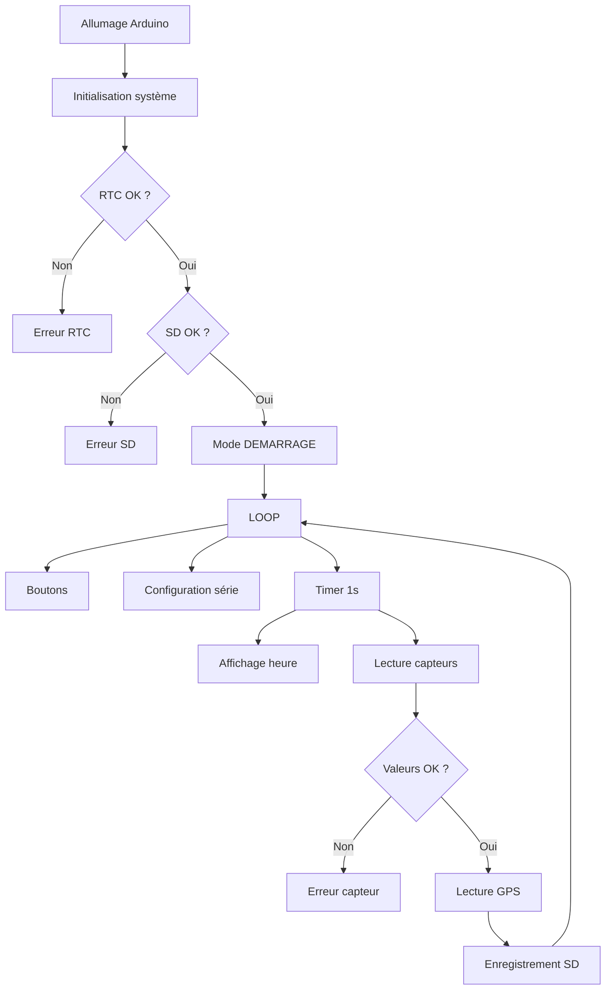
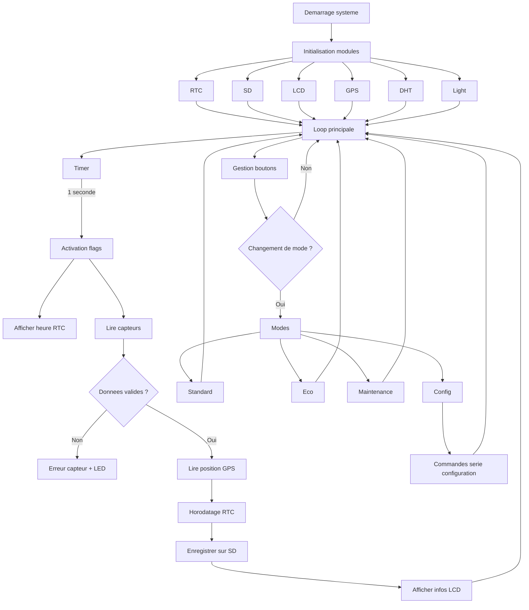

# Schéma de fonctionnement global

```mermaid
flowchart TD

START[Allumage Arduino]

START --> INIT[Initialisation système]

INIT --> CHECKRTC{RTC OK ?}

CHECKRTC -- Non --> RTCERROR[Erreur RTC]
CHECKRTC -- Oui --> CHECKSD{SD OK ?}

CHECKSD -- Non --> SDERROR[Erreur SD]
CHECKSD -- Oui --> MODE[Mode DEMARRAGE]

MODE --> LOOP

LOOP --> BTN[Boutons]
LOOP --> SERIAL[Configuration série]

LOOP --> TIMER[Timer 1s]

TIMER --> CLOCK[Affichage heure]
TIMER --> SENSORS[Lecture capteurs]

SENSORS --> CHECKVAL{Valeurs OK ?}

CHECKVAL -- Non --> ERRORCAPT[Erreur capteur]
CHECKVAL -- Oui --> GPS[Lecture GPS]

GPS --> SAVE[Enregistrement SD]

SAVE --> LOOP
```

```mermaid
flowchart TD

Start[Demarrage systeme] --> Init[Initialisation modules]

Init --> RTC
Init --> SD
Init --> LCD
Init --> GPS
Init --> DHT
Init --> Light

RTC --> Loop
SD --> Loop
LCD --> Loop
GPS --> Loop
DHT --> Loop
Light --> Loop

Loop[Loop principale]

Loop --> Timer

Timer -->|1 seconde| Flags[Activation flags]

Flags --> AffHeure[Afficher heure RTC]
Flags --> LireCapteurs[Lire capteurs]

LireCapteurs --> VerifCapteurs{Donnees valides ?}

VerifCapteurs -- Non --> ErreurCapteurs[Erreur capteur + LED]
VerifCapteurs -- Oui --> GPSpos[Lire position GPS]

GPSpos --> Horodatage[Horodatage RTC]

Horodatage --> SaveSD[Enregistrer sur SD]

SaveSD --> LCDdisplay[Afficher infos LCD]

LCDdisplay --> Loop

Loop --> Boutons[Gestion boutons]

Boutons --> ModeChange{Changement de mode ?}

ModeChange -- Oui --> Modes
ModeChange -- Non --> Loop

Modes --> Standard
Modes --> Eco
Modes --> Maintenance
Modes --> Config

Standard --> Loop
Eco --> Loop
Maintenance --> Loop
Config --> Serie

Serie[Commandes serie configuration] --> Loop
```

