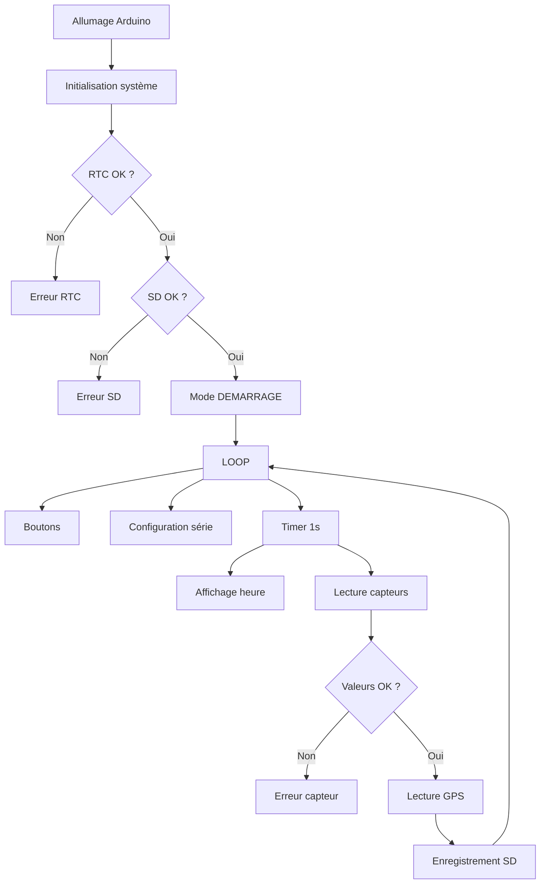

Parfait. Je vais te fournir **les 3 éléments demandés**, prêts à être utilisés dans ton dépôt GitHub :

1. **README professionnel (structure open-source)**
2. **diagramme d’architecture du code**
3. **schéma de fonctionnement du système**

Tu pourras copier-coller directement dans ton repository.

---

# 1️⃣ README GitHub propre (structure projet)

```markdown
# 🌦️ Arduino Environmental Data Logger

Station de mesure environnementale basée sur Arduino capable de :

- mesurer **température**
- mesurer **humidité**
- mesurer **luminosité**
- récupérer la **position GPS**
- afficher les informations sur **écran LCD**
- enregistrer les données sur **carte SD**
- gérer plusieurs **modes de fonctionnement**
- être configurée via **port série**

---

# 📦 Fonctionnalités

✔ Mesure environnementale  
✔ Enregistrement des données en **CSV**  
✔ Horodatage via **RTC DS1307**  
✔ Position GPS  
✔ Interface utilisateur **LCD + LED RGB + boutons**  
✔ Configuration dynamique via **Serial Monitor**  
✔ Gestion d’erreurs (capteurs, SD, RTC)

---

# 🧰 Matériel utilisé

| Composant | Modèle |
|---|---|
| Microcontrôleur | Arduino Uno |
| Capteur température/humidité | DHT11 |
| Horloge temps réel | DS1307 |
| GPS | Module GPS UART |
| Écran LCD | Grove RGB LCD |
| LED | Chainable RGB LED |
| Carte mémoire | Micro SD |
| Capteur luminosité | LDR analogique |
| Boutons | 2 boutons poussoirs |

---

# ⚙️ Architecture du programme

Le programme est organisé en plusieurs modules :

- **Initialisation système**
- **Gestion des modes**
- **Lecture des capteurs**
- **Gestion GPS**
- **Gestion RTC**
- **Gestion carte SD**
- **Interface utilisateur**
- **Gestion des erreurs**

---

# 🔄 Modes de fonctionnement

| Mode | Description |
|---|---|
| DEMARRAGE | initialisation du système |
| CONFIGURATION | configuration via port série |
| STANDARD | fonctionnement normal |
| ECONOMIQUE | enregistrement plus espacé |
| MAINTENANCE | diagnostic du système |

---

# 💻 Commandes série

Dans le **Serial Monitor** :

```

LOG_INTERVAL=10
MIN_TEMP_AIR=0
MAX_TEMP_AIR=40
HYGR_MIN=10
HYGR_MAX=90
MIN_LUMIN=50
MAX_LUMIN=900
RESET
VERSION

```

---

# 📁 Format du fichier de données

Les données sont enregistrées dans :

```

donnees.csv

```

Exemple :

```

2026-03-01 14:22:10;23.5;45;350;43.6045;1.4442

```

Format :

```

date heure;temperature;humidite;luminosite;latitude;longitude

```

---

# 🚨 Gestion des erreurs

Le système signale les problèmes via la **LED RGB** :

| Couleur | Signification |
|---|---|
| Rouge | erreur capteur |
| Bleu | erreur RTC |
| Blanc/Rouge | erreur carte SD |
| Rouge/Vert clignotant | incohérence capteurs |

---

# 📂 Structure du projet

```

project/
│
├── main.ino
├── README.md
└── donnees.csv

```

---

# 👨‍💻 Auteur

Projet Arduino – Data Logger environnemental.
```

---

# 2️⃣ Diagramme d’architecture du code

Tu peux l’ajouter dans ton README avec **Mermaid** (GitHub l’affiche automatiquement).

````markdown
# 🧩 Architecture du programme

```mermaid
flowchart TD

A[setup()] --> B[Initialisation capteurs]
A --> C[Initialisation RTC]
A --> D[Initialisation SD]
A --> E[Configuration Timer]

F[loop()] --> G[Gestion boutons]
F --> H[Configuration série]
F --> I[Lecture GPS]

F --> J[flagHorloge]
J --> K[afficherHeure]

F --> L[flagCapteurs]
L --> M[lireCapteurs]

M --> N[verification capteurs]
N --> O[lecture GPS]
O --> P[enregistrement SD]

P --> Q[donnees.csv]
````

---

# 3️⃣ Schéma de fonctionnement global

```markdown
# ⚙️ Fonctionnement du système
```




