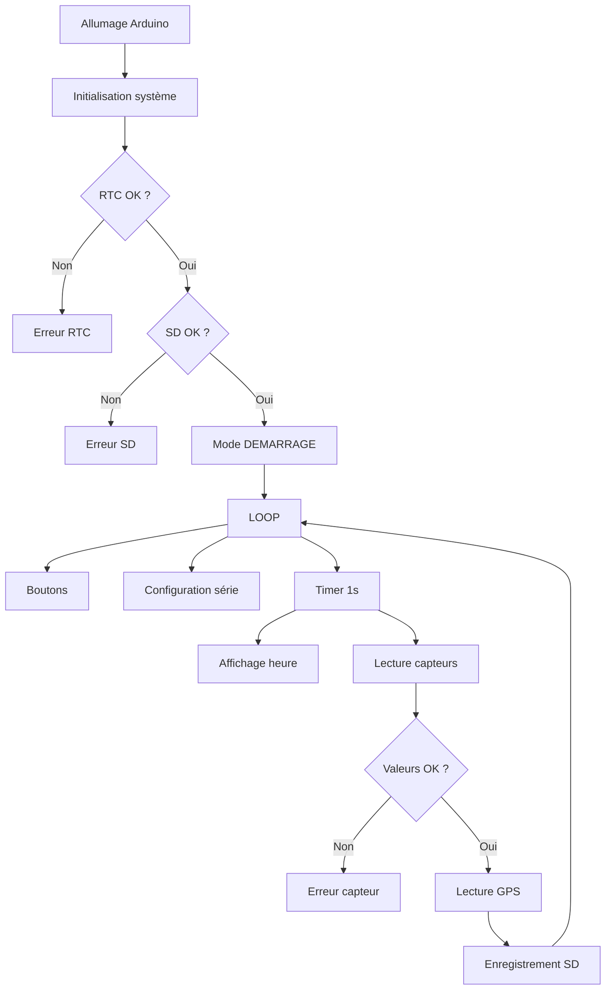

# Schéma de fonctionnement global

```mermaid
flowchart TD

START[Allumage Arduino]

START --> INIT[Initialisation système]

INIT --> CHECKRTC{RTC OK ?}

CHECKRTC -- Non --> RTCERROR[Erreur RTC]
CHECKRTC -- Oui --> CHECKSD{SD OK ?}

CHECKSD -- Non --> SDERROR[Erreur SD]
CHECKSD -- Oui --> MODE[Mode DEMARRAGE]

MODE --> LOOP

LOOP --> BTN[Boutons]
LOOP --> SERIAL[Configuration série]

LOOP --> TIMER[Timer 1s]

TIMER --> CLOCK[Affichage heure]
TIMER --> SENSORS[Lecture capteurs]

SENSORS --> CHECKVAL{Valeurs OK ?}

CHECKVAL -- Non --> ERRORCAPT[Erreur capteur]
CHECKVAL -- Oui --> GPS[Lecture GPS]

GPS --> SAVE[Enregistrement SD]

SAVE --> LOOP
```

