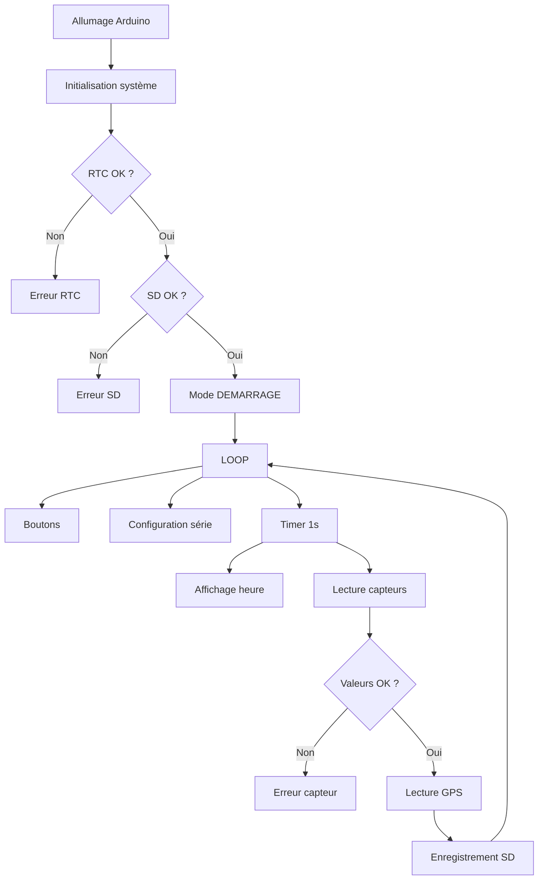
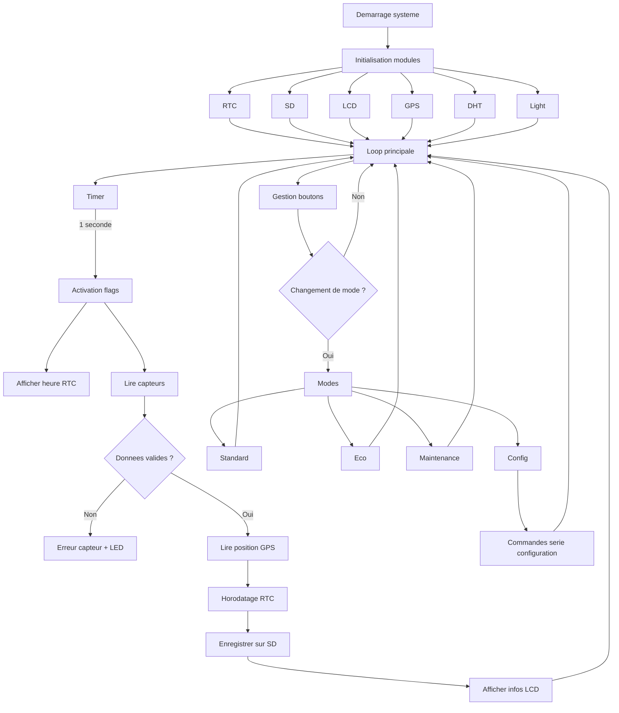
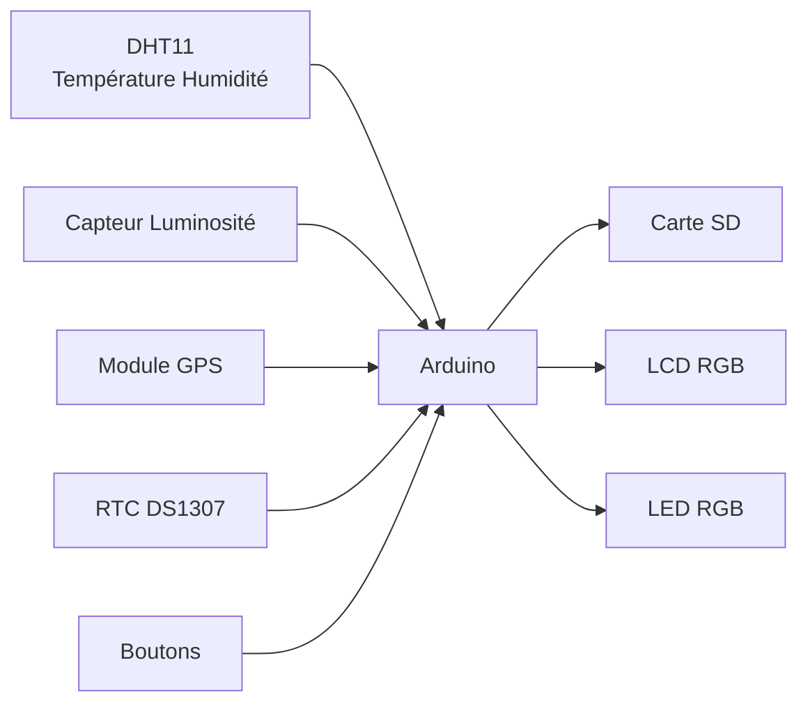
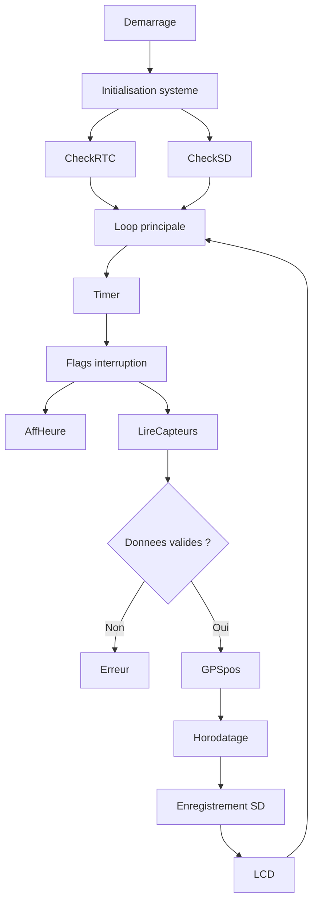
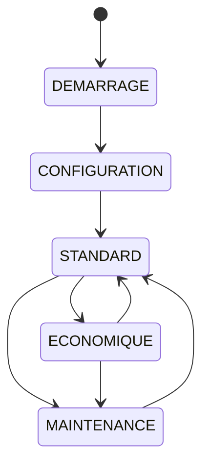

# Schéma de fonctionnement global





# Architecture du système

## Vue globale du système

Le projet implémente une **station de mesure environnementale embarquée** basée sur un microcontrôleur Arduino.
Le système collecte périodiquement plusieurs données environnementales, les horodate et les enregistre dans un fichier CSV sur une carte SD.

Les principales fonctionnalités sont :

* acquisition de **température et humidité**
* mesure de **luminosité**
* récupération de la **position GPS**
* horodatage via **RTC**
* stockage des données sur **carte SD**
* affichage sur **écran LCD**
* gestion de plusieurs **modes de fonctionnement**

---

# 1. Architecture matérielle

## Diagramme d’architecture



---

## Explication du diagramme

Ce diagramme représente l’**architecture matérielle du système**.

Le **microcontrôleur Arduino** est le cœur du système. Il coordonne toutes les interactions entre les capteurs, les périphériques d'affichage et les modules de stockage.

### Capteurs

Trois capteurs fournissent les données environnementales :

**DHT11**

* mesure la température de l’air
* mesure l’humidité relative

**Capteur de luminosité**

* connecté sur une entrée analogique
* fournit une valeur entre **0 et 1023**

**GPS**

* communique via **liaison série**
* fournit latitude et longitude

---

### Modules système

**RTC DS1307**

* horloge temps réel
* fournit la date et l’heure
* utilisé pour horodater les mesures

**Carte SD**

* stockage permanent des mesures
* format CSV

---

### Interfaces utilisateur

**LCD RGB**

affiche :

* le mode du système
* l’heure
* l’état GPS
* les erreurs

**LED RGB**

indique visuellement :

* le mode actif
* les erreurs

**Boutons**

permettent de :

* changer le mode du système
* accéder à la configuration

---

# 2. Flux d'information du système

## Diagramme de fonctionnement



---

## Explication du fonctionnement

Le système suit un **cycle de fonctionnement périodique**.

### 1 Initialisation

Lors du démarrage (`setup()`), le programme initialise :

* le port série
* le capteur DHT
* la communication I2C
* le module GPS
* l’écran LCD
* la carte SD
* le RTC
* le timer d'interruption

---

### 2 Boucle principale

La fonction `loop()` est le cœur du programme.

Elle exécute en continu :

* gestion des boutons
* configuration série
* décodage GPS
* vérification des erreurs
* traitement des flags d’interruption

---

### 3 Gestion du timer

Le **Timer1** génère une interruption toutes les **1 seconde**.

Cette interruption active deux flags :

```
flagHorloge
flagCapteurs
```

Ces flags déclenchent :

* l’affichage de l’heure
* la lecture des capteurs

Cette approche évite de bloquer la boucle principale.

---

### 4 Lecture des capteurs

Les capteurs mesurent :

* température
* humidité
* luminosité

Les valeurs sont ensuite **vérifiées** :

* cohérence
* limites configurées

Si une incohérence est détectée :

* affichage d’erreur
* clignotement de la LED

---

### 5 Acquisition GPS

Si le GPS fournit des coordonnées valides :

* latitude
* longitude

elles sont ajoutées à la mesure.

Sinon la valeur **NA** est enregistrée.

---

### 6 Enregistrement des données

Les données sont stockées dans :

```
donnees.csv
```

Format :

```
date heure;temperature;humidite;luminosite;latitude;longitude
```

Exemple :

```
2026-03-01 14:22:03;22.4;45.2;512;43.604652;1.444209
```

---

# 3. Machine d’état des modes

Le système fonctionne selon **plusieurs modes opérationnels**.

## Diagramme des modes



---

## Explication des modes

### Mode DEMARRAGE

Mode actif au lancement du système.

Fonctions :

* initialisation du matériel
* vérification RTC et SD

---

### Mode CONFIGURATION

Permet de modifier les paramètres via le **port série**.

Exemples :

```
LOG_INTERVAL=10
MIN_TEMP_AIR=0
MAX_TEMP_AIR=35
RESET
VERSION
```

Les paramètres sont stockés dans **EEPROM**.

---

### Mode STANDARD

Mode normal de fonctionnement.

* lecture capteurs
* enregistrement sur SD
* fréquence normale

Intervalle :

```
LOG_INTERVAL secondes
```

---

### Mode ECONOMIQUE

Mode basse consommation.

Fonctionnement identique au mode standard mais :

```
intervalle = LOG_INTERVAL × 2
```

---

### Mode MAINTENANCE

Utilisé pour :

* diagnostic
* tests
* maintenance système

Les données ne sont pas enregistrées.

---

# 4. Architecture du code

Le programme est structuré en plusieurs blocs fonctionnels.

```
Programme Arduino
│
├── Setup
│   ├── Initialisation matériel
│   ├── Initialisation RTC
│   ├── Initialisation SD
│   ├── Initialisation capteurs
│   └── Configuration Timer
│
├── Loop principale
│   ├── gestion boutons
│   ├── configuration série
│   ├── décodage GPS
│   ├── affichage heure
│   └── lecture capteurs
│
├── Gestion capteurs
│   ├── DHT11
│   ├── luminosité
│   └── GPS
│
├── Gestion stockage
│   ├── ouverture SD
│   ├── écriture CSV
│   └── vérification mémoire
│
├── Gestion interface
│   ├── LCD
│   ├── LED RGB
│   └── boutons
│
└── Gestion interruptions
    └── Timer1 (1 Hz)
```

---

# 5. Gestion des erreurs

Le système implémente plusieurs mécanismes de sécurité.

## RTC déconnecté

Affichage :

```
RTC erreur
```

La LED clignote en **bleu/rouge**.

---

## Carte SD absente

Affichage :

```
SD absente
```

Les données ne peuvent pas être enregistrées.

---

## Carte SD pleine

Affichage :

```
SD pleine
```

L’enregistrement est stoppé.

---

## Erreur capteur

Détectée si :

* valeur incohérente
* capteur saturé
* données invalides

Signalisation :

* message LCD
* LED rouge/verte clignotante

---

# 6. Stockage des paramètres

Certains paramètres sont sauvegardés en **EEPROM**.

Exemple :

```
LOG_INTERVAL
```

Adresse mémoire :

```
EEPROM_ADDR_LOG_INTERVAL
```

Cela permet de conserver la configuration après redémarrage.


