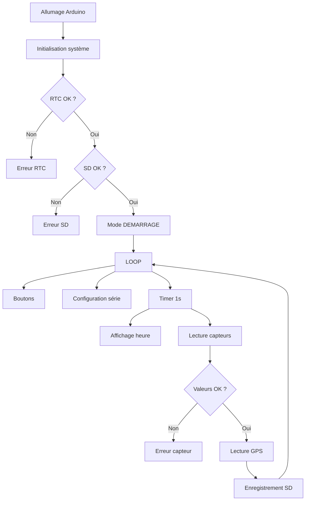
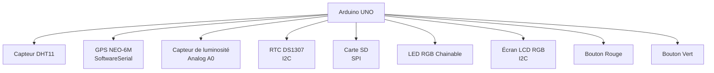
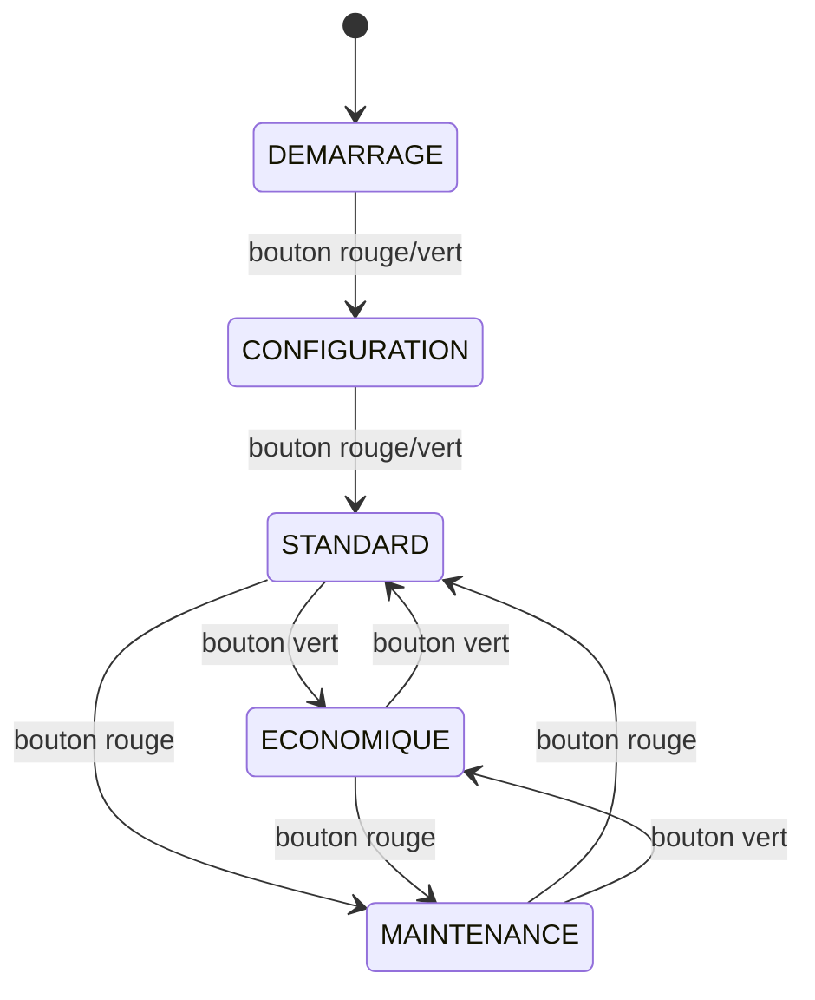

# 3️⃣ Schéma de fonctionnement global

```markdown
# ⚙️ Fonctionnement du système
```




# 🌦️ Présentation

Ce projet implémente une **station météo complète** basée sur Arduino, intégrant :

- Capteur DHT11 (température / humidité)  
- Capteur de luminosité analogique  
- Module GPS NEO‑6M  
- Module RTC DS1307  
- Carte SD pour l’enregistrement CSV  
- Écran LCD RGB  
- LED RGB chainable  
- Deux boutons pour naviguer entre les modes  
- Une architecture robuste basée sur un **timer matériel**, une **machine d’état**, et des **seuils de sécurité capteurs**


# 📑 Table des matières

```md
# Table des matières
- [Présentation](#présentation)
- [Diagrammes Mermaid](#diagrammes-mermaid)
  - [Architecture matérielle](#architecture-matérielle)
  - [Machine d’état](#machine-détat)
  - [Cycle de fonctionnement](#cycle-de-fonctionnement)
- [Structure du code](#structure-du-code)
  - [1. Bibliothèques](#1-bibliothèques)
  - [2. Constantes matérielles](#2-constantes-matérielles)
  - [3. Objets matériels](#3-objets-matériels)
  - [4. Paramètres configurables](#4-paramètres-configurables)
  - [5. Seuils capteurs](#5-seuils-capteurs)
  - [6. États internes](#6-états-internes)
  - [7. Modes de fonctionnement](#7-modes-de-fonctionnement)
  - [8. Flags d’interruptions](#8-flags-dinterruptions)
  - [9. Gestion des boutons](#9-gestion-des-boutons)
  - [10. Textes PROGMEM](#10-textes-progmem)
  - [11. Informations version et SD](#11-informations-version-et-sd)
  - [12. Prototypes](#12-prototypes)
  - [13. Interruption Timer1](#13-interruption-timer1)
  - [14. Configuration Timer1](#14-configuration-timer1)
  - [15. Setup](#15-setup)
  - [16. Loop](#16-loop)
  - [17. Configuration série](#17-configuration-série)
  - [18. Gestion LCD](#18-gestion-lcd)
  - [19. Changement de mode](#19-changement-de-mode)
  - [20. Affichage de l’heure](#20-affichage-de-lheure)
  - [21. Lecture des capteurs](#21-lecture-des-capteurs)
  - [22. Gestion SD](#22-gestion-sd)
  - [23. Clignotements LED](#23-clignotements-led)
  - [24. Test RTC](#24-test-rtc)
  - [25. Gestion des boutons](#25-gestion-des-boutons)
- [Code complet découpé et expliqué](#code-complet-découpé-et-expliqué)
- [Conclusion](#conclusion)
```

---

# 🧩 Diagrammes Mermaid

## 🛠️ Architecture matérielle



---

## 🔁 Machine d’état



---

## 🔄 Cycle de fonctionnement

```mermaid
flowchart LR
    A[Interruption Timer1<br>1 Hz] --> B[flagHorloge = true]
    A --> C[flagCapteurs = true]

    B --> D[afficherHeure()]
    C --> E[lireCapteurs()]

    E --> F[Validation des capteurs]
    F -->|OK| G[Enregistrement CSV sur SD]
    F -->|Erreur| H[Clignotement incohérence<br>LED Rouge/Vert]
```


