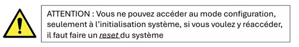
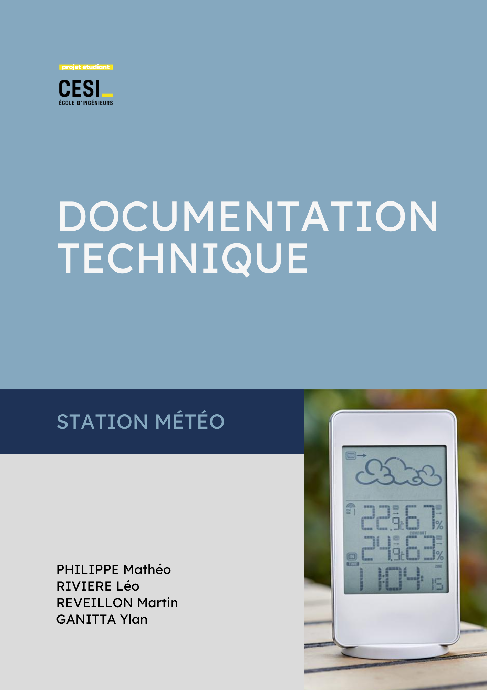
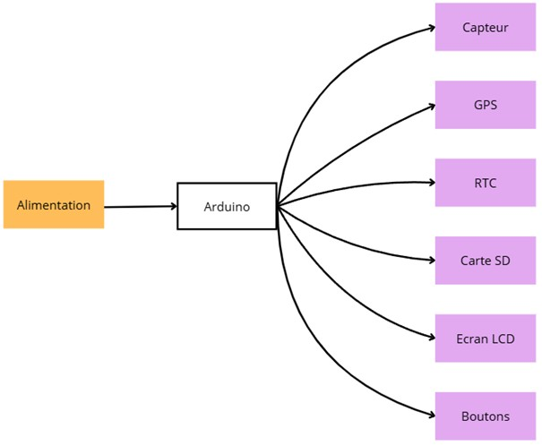
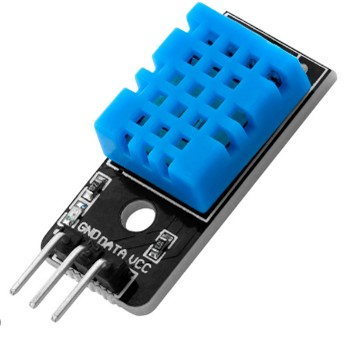
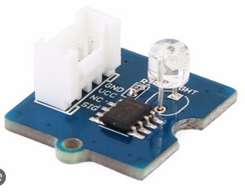
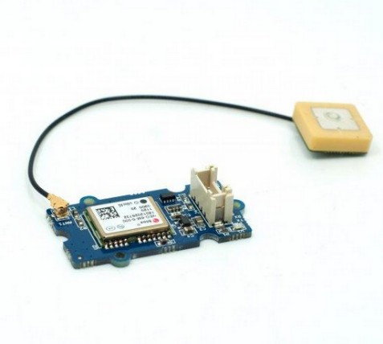
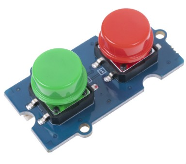
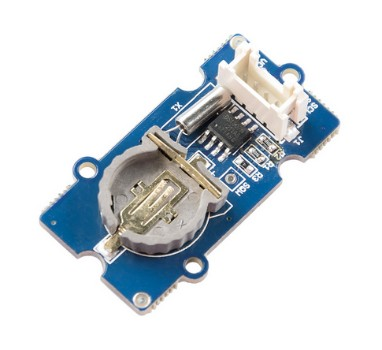
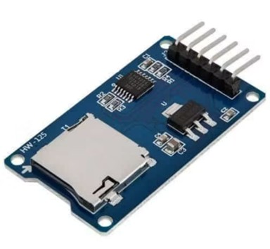
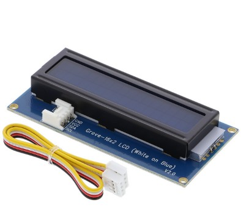

# Sommaire

- [Manuel d'utilisation](#manuel-dutilisation)
  - [Introduction](#introduction)
  - [Mise en service](#mise-en-service)
  - [Fonctionnement](#fonctionnement)
  - [Lecture des informations](#lecture-des-informations)
  - [Récupération des données](#récupération-des-données)
  - [Entretien](#entretien)
  - [Mode de fonctionnement](#mode-de-fonctionnement)
  - [Mode standard](#mode-standard)
  - [Mode configuration](#mode-configuration)
  - [Mode maintenance](#mode-maintenance)
  - [Mode économique](#mode-économique)
  - [Matériel fourni](#matériel-fourni)

- [Documentation technique](#documentation-technique)
  - [Introduction technique](#introduction-technique)
  - [Fonction du système](#fonction-du-système)
  - [Utilisation en mer](#utilisation-en-mer)
  - [Architecture](#architecture)
  - [Cœur du système](#cœur-du-système)
  - [Capteurs](#capteurs)
  - [Performances du système](#performances-du-système)
  - [Fiabilité des données](#fiabilité-des-données)
  - [Annexe](#annexe)

---

---

# Manuel d'utilisation

## Introduction

Cette station météo permet de **mesurer et enregistrer plusieurs paramètres environnementaux** afin de suivre les conditions météorologiques d’un lieu donné.

Le système collecte automatiquement les informations suivantes :

- Température ambiante
- Humidité de l'air
- Luminosité
- Position GPS
- Date et heure des mesures

Les données sont ensuite enregistrées sur une **carte SD** afin d’être analysées sur un ordinateur.

---

## Mise en service

1. Insérer la **carte SD** dans son emplacement.
2. Vérifier que la **pile du module RTC** est installée.
3. Alimenter la station météo.
4. Attendre environ **2 minutes** pour l'initialisation des capteurs.
5. Sélectionner un mode avec les **boutons rouge ou vert**.

Une fois l'initialisation terminée, vous pouvez passer la station en mode configuration. Une fois paramétré, vous pouvez passer en mode standard ou en mode éco et la station commence automatiquement l'enregistrement des données.

---

## Fonctionnement

La station météo mesure régulièrement les conditions environnementales grâce à ses capteurs.

Les données :

1. sont collectées par **l'Arduino**
2. sont **horodatées avec le module RTC**
3. sont **enregistrées sur la carte SD**

Ces données peuvent ensuite être récupérées pour analyse.

---

## Lecture des informations

Le système possède un **écran LCD** permettant d'afficher :

- le mode actuel
- l'heure du système

D'autres informations sont accessibles via la **console série**, comme l'état des capteurs.

---

## Récupération des données

Pour récupérer les données :

1. Passer la station en **mode maintenance**
2. Retirer la **carte SD**
3. Insérer la carte dans un ordinateur

Les données peuvent être ouvertes avec :

- Excel
- LibreOffice
- tout autre tableur.

---

## Entretien

Pour garantir le bon fonctionnement :

- vérifier régulièrement l’espace disponible sur la carte SD
- protéger la station contre l’humidité
- remplacer la pile du **module RTC** si nécessaire

---

## Mode de fonctionnement

La station propose plusieurs **modes de fonctionnement** permettant d’adapter son comportement :

- acquisition normale des données
- configuration
- maintenance
- économie d’énergie

Les modes sont sélectionnés via **les boutons de commande**.

---

## Mode standard

Mode principal du système.

Il permet :

- la lecture des capteurs
- l’enregistrement des données sur la carte SD

Les mesures sont réalisées **toutes les 4 secondes**.

---

## Mode configuration

Dans ce mode :

- l’acquisition des données est temporairement désactivée
- il est possible de modifier ou remplacer les capteurs

Pour quitter ce mode, il suffit de sélectionner un autre mode avec les boutons.

---

## Mode maintenance

Accessible depuis :

- mode standard
- mode configuration

Ce mode permet :

- consulter les données en direct
- retirer la carte SD en sécurité
- éviter la corruption des fichiers.

Pour quitter ce mode, appuyer à nouveau sur **le bouton rouge**.

---

## Mode économique

Ce mode permet de **réduire la consommation d’énergie**.

Certaines fonctions sont désactivées :

- capteur température / humidité
- capteur luminosité

Les mesures restantes sont effectuées **moins fréquemment** afin d’économiser l’énergie.

---

## Matériel fourni

- Arduino Uno R3
- Base Shield Arduino
- Dual Button (D6)
- Module RTC (I2C)
- Module GPS (D8)
- Capteur température / humidité (D2)
- Capteur luminosité (A0)
- LED RGB (D4)
- Écran LCD (I2C)
- Adaptateur Micro SD

---

---

# Documentation technique

## Introduction technique

La station météo embarquée permet de **collecter et enregistrer des données météorologiques** en mer grâce à plusieurs capteurs.

Les données sont stockées sur **carte SD** afin de constituer un historique.

---

## Fonction du système

Le système mesure différents paramètres environnementaux et fournit :

- des données en temps réel
- un enregistrement des mesures.

---

## Utilisation en mer

La station est conçue pour être :

- simple d’utilisation
- fiable
- facilement manipulable par l’équipage.

Les données permettent de suivre l’évolution des conditions météorologiques.

---

## Architecture

Le système repose sur une **architecture modulaire basée sur Arduino**.

La carte Arduino :

- collecte les données des capteurs
- traite les informations
- enregistre les mesures.

---

## Cœur du système

L’unité centrale utilise un **microcontrôleur ATmega328**.

Il gère :

- les capteurs
- le stockage des données
- les communications entre modules.

---

## Capteurs

### Capteur DHT11 :

Le **capteur DHT11** permet d'acquérir les données de température et d'humidité de l'environnement, constituant des paramètres essentiels pour la surveillance des conditions météorologiques.

- Intervalle de mesure de température : 0° - 50°
- Précision de température d'environ ±2 °C
- Mesure d'humidité 20% - 90%
- Précisions d'humidité ±5 %

---

### Capteur de luminosité LM358 :

Capteur de luminosité **LM358** est utilisé pour traiter ou adapter le signal provenant du capteur de luminosité **analogique**. Capteur permettant de mesurer l'intensité de la lumière ambiante. Ce capteur est basé sur une **photorésistance (LDR)** dont la résistance électrique varie en fonction de l'intensité lumineuse reçue.

Tension de fonctionnement : 3 ~ 5 V
- Courant de fonctionnement : 0,5 ~ 3 mA
- Temps de réponse : 20 à 30 millisecondes
- Longueur d'onde max (pic de sensibilité) : 540 nm

---

### Le module GPS V1.2 :

Dans le programme embarqué, le **module GPS** est utilisé pour récupérer les coordonnées géographiques (latitude, longitude) et l'heure satellite. Le traitement logiciel doit intégrer la lecture des trames, leur décodage, la vérification de la validité des données.

- Alimentation : 3,3 ou 5 Vcc
- Consommation : 60 mA maxi

Précision :

- Distance : 2,5 m
- Vitesse : 0,1 m/s
- Dimensions interface GPS : 40 x 20 mm

---

### Le Dual Button :

Cet écran permet d'afficher jusqu'à 32 caractères, avec prise en charge des alphabets anglais, japonais et grec. Idéal pour l'affichage de la température ou de l'heure, ou tout autre projet nécessitant un affichage simple. Cet appareil, communique avec le microcontrôleur via un bus I2C, utilisant seulement deux fils pour la communication par un port d'entrée du microcontrôleur.

Ce Dual Button comprend 2 boutons, permettant de contrôler deux canaux de signal avec un seul module Grove et 2 touches de couleurs différentes. Ces boutons sont connectés par un port de sortie numérique du microcontrôleur.

---

### L'horloge RTC DS1307 :

**Le module RTC** (Real Time Clock) assure une disponibilité immédiate de l'heure pour le système, tandis que l'heure fournie par le GPS dépend de la réception et de la synchronisation avec les satellites. Cette horloge a la capacité d'horodater les mesures enregistrer sur la carte SD. Le bus de communication utilisé par ce périphérique est le bus I2C. Il permet de communiquer avec le microcontrôleur avec seulement deux fils par un port d'entrée du microcontrôleur.

---

### Stockage des données :

Le module lecteur de **carte SD** est utilisé pour assurer le stockage des données mesurées par la station météo. Il communique avec le microcontrôleur Arduino grâce au bus de communication SPI (Serial Peripheral Interface), un protocole de communication série rapide utilisé pour connecter des périphériques externes.

À intervalles réguliers, le programme enregistre les données collectées par les capteurs dans des fichiers sur la carte SD, ce qui permet de conserver un historique des mesures

L'adaptateur micro SD utilise l'interface SPI pour la communication, ce qui signifie qu'il a besoin des broches suivantes :

- MISO (Master In Slave Out) : Données envoyées du module SD vers l'Arduino.
- MOSI (Master Out Slave In) : Données envoyées de l'Arduino vers le module SD.
- SCK (Serial Clock) : Signal horloge SPI.
- CS (Chip Select) : Sélectionne le module SD pour la communication SPI.
- VCC : Alimentation (5V ou 3.3V selon le module).
- GND : Masse.

---

### Interface utilisateur

L'interface utilisateur permet d'accéder aux informations de diagnostic du système directement sur l'interface LCD. Cette interface assure deux rôles principaux :

- Elle permet à l'utilisateur de consulter l'heure et dans le mode dans lequel on se situe.

---

## Performances du système

Les mesures sont réalisées à **intervalle régulier** afin de garantir un suivi précis.

---

## Fiabilité des données

Le système intègre plusieurs mécanismes :

- détection des capteurs défaillants
- gestion des erreurs de stockage.

---

## Annexe

En cas de panne d'un composant, vous retrouverez tous les liens d'achat afin de les remplacer :

| Numéro | Composant | Référence |
|------|------|------|
| 1 | LED | Grove Chainable RGB LED v2.0 |
| 2 | GPS | GPS v1.2 |
| 3 | Capteur température | Temperature & Humidity Sensor v1.2 |
| 4 | Bouton | Grove Dual Button v1.0 |
| 5 | Horloge RTC | RTC v1.2 |
| 6 | Écran LCD | Grove 16x2 LCD |
| 7 | Capteur luminosité | Grove Light Sensor |
| 8 | Lecteur carte SD | MicroSD Adapter |

| 1   | <https://www.seeedstudio.com/Grove-Chainable-RGB-Led-V2-0.html?srsltid=AfmBOoopLSa5JXDmyhigDcTRJl0l9IwTUCI8-6ugEC-FKyWypG1TR0iI>                                                                                                                                                                                                 |
| --- | -------------------------------------------------------------------------------------------------------------------------------------------------------------------------------------------------------------------------------------------------------------------------------------------------------------------------------- |
| 2   | <https://www.seeedstudio.com/Grove-GPS-Module.html>                                                                                                                                                                                                                                                                              |
| 3   | <https://fr.rs-online.com/web/p/kits-de-developpement-pour-capteur/1743237?cm_mmc=FR-PLA-DS3A-_-google-_-CSS_FR_FR_PMAX_Catch+All-_--_-1743237&matchtype=&&gclsrc=aw.ds&gad_source=1&gad_campaignid=20578377983&gclid=CjwKCAjwyMnNBhBNEiwA-Kcgu_zFja3RZ4zy-4A3ifVznl2PQomLqwlRWXZQF55R1xDjtgqUaQWeBxoCo4oQAvD_BwE>               |
| 4   | <https://www.digikey.fr/fr/products/detail/seeed-technology-co-ltd/111020103/12086987?gclsrc=aw.ds&gad_source=1&gad_campaignid=19538088363&gclid=CjwKCAjwyMnNBhBNEiwA-Kcgu5YAvAIQ4zvoPTqP6Qc-bjzGWFuBTEASg-r6qxNdw7jkOGR-QfYH4hoCPycQAvD_BwE>                                                                                    |
| 5   | <https://fr.rs-online.com/web/p/modules-de-developpement-pour-horloges-et-timers/1845075?cm_mmc=FR-PLA-DS3A-_-google-_-CSS_FR_FR_PMAX_Catch+All-_--_-1845075&matchtype=&&gclsrc=aw.ds&gad_source=1&gad_campaignid=20578377983&gclid=CjwKCAjwyMnNBhBNEiwA-Kcgu5VSNIfiQn9dXa2Ian5rUPgdQKLerUg1pMot19BxmMHciPx2Hdv9SRoCQLYQAvD_BwE> |
| 6   | <https://www.gotronic.fr/art-afficheur-lcd-2x16-grove-104020111-28878.htm?srsltid=AfmBOopa9WoYuhySEHwfjtRrwf1EXwcijFHfzBcHJETGct7umQSj-x9->                                                                                                                                                                                      |
| 7   | <https://fr.rs-online.com/web/p/kits-de-developpement-pour-capteur/1743246?cm_mmc=FR-PLA-DS3A-_-google-_-CSS_FR_FR_PMAX_Catch+All-_--_-1743246&matchtype=&&gclsrc=aw.ds&gad_source=1&gad_campaignid=20578377983&gclid=CjwKCAjwyMnNBhBNEiwA-Kcgu0W5qp00JmmtmUaLkbr4htFvvQrjQ4tYOzYhnDrN5iJPvBAwA1gzDBoCMUUQAvD_BwE>               |
| 8   | <https://www.reichelt.com/fr/fr/shop/produit/cartes_de_developpement_-_carte_de_derivation_pour_cartes_micros-266045?PROVID=2810&gad_source=1&gad_campaignid=17990194063&gclid=CjwKCAjwyMnNBhBNEiwA-Kcgu3MCG60gGS0RYHaJbZTc2_c2ytwf9xP-jyO5Zje4B7t2VpYkvDZYWBoClvkQAvD_BwE>                                                      |
