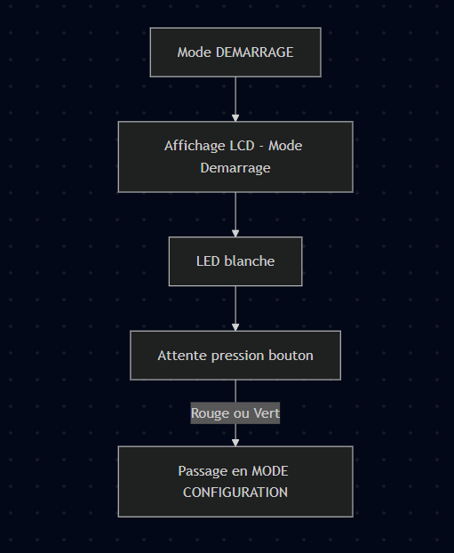
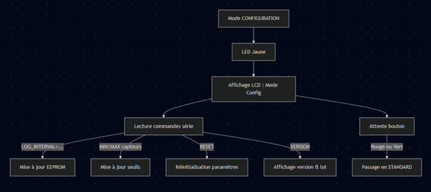
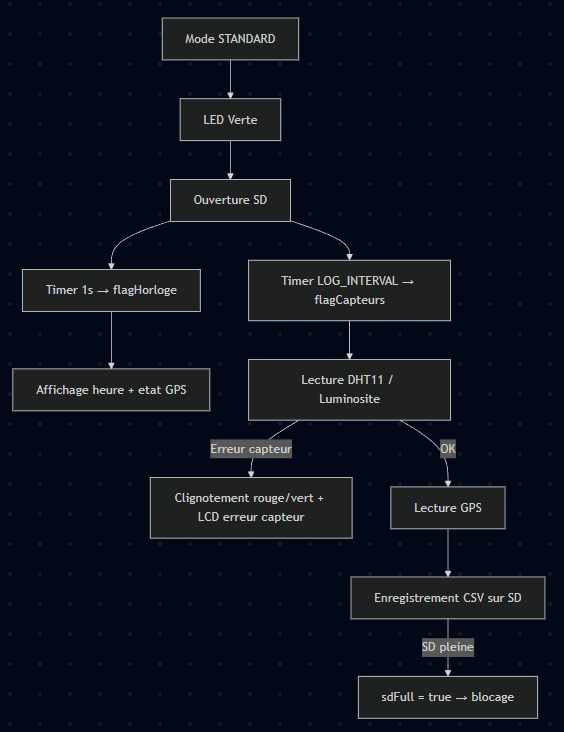
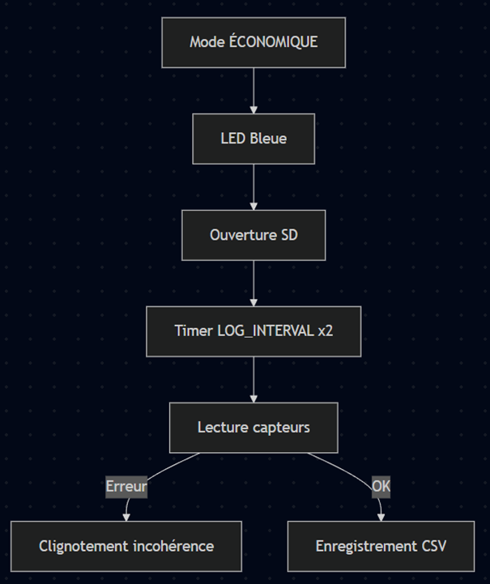
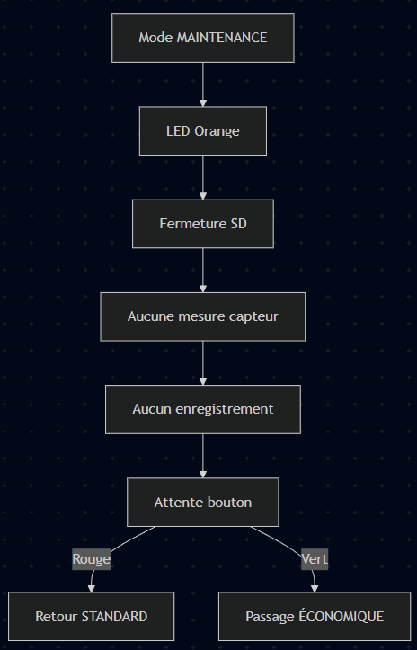

# Schéma de focntionnement
Dans cette partie nous vreeons différents schéma de fciontionnement en focntiond es différents modes présent sur notre station météo, nous verrons :

-**Vue globale des transitions entre modes**  
-**Mode DÉMARRAGE**  
-**Mode CONFIGURATION**  
-**Mode STANDARD**  
-**Mode ÉCONOMIQUE**  
-**Mode MAINTENANCE**

Chaque diagramme aura un commentaire sur son déroulé.

---

# Vue globale — Diagramme des transitions entre modes

  

Ce diagramme illustre la logique complète de navigation entre les modes, entièrement pilotée par les deux boutons physiques (Rouge et Vert).
Il met en évidence plusieurs points importants : Le système démarre toujours en mode DÉMARRAGE, un état transitoire.

Les deux boutons permettent ensuite d’accéder au mode CONFIGURATION, indispensable pour régler les paramètres internes.

Les modes STANDARD, ÉCONOMIQUE et MAINTENANCE forment un trio fonctionnel permettant d’adapter le comportement de la station : STANDARD = fonctionnement normal, mesures régulières.

ÉCONOMIQUE = réduction de la fréquence des mesures pour économiser énergie et SD.

MAINTENANCE = arrêt des mesures pour manipuler le matériel en sécurité.

Les transitions sont strictement définies pour éviter les erreurs d’utilisation et garantir une navigation cohérente.

Ce schéma donne une vision d’ensemble du fonctionnement de la station et sert de base pour comprendre les diagrammes suivants.

---

# Mode DÉMARRAGE

Le mode DÉMARRAGE est un état très simple mais essentiel : Il sert de point d’entrée du système après la mise sous tension.

Le LCD affiche un message clair indiquant que la station est en phase d’initialisation.

La LED blanche signale visuellement que le système n’est pas encore opérationnel.

Aucune mesure n’est effectuée : ce mode est volontairement minimaliste.

Le système attend une action utilisateur pour continuer, ce qui évite tout comportement inattendu au démarrage.

Ce mode garantit que l’utilisateur prend le contrôle dès le début et qu’aucune mesure ou écriture SD ne démarre sans validation humaine.

---

# Mode CONFIGURATION

En mode **CONFIGURATION** :

Le mode CONFIGURATION est le seul mode où l’utilisateur peut modifier les paramètres internes de la station :

La LED jaune indique clairement que la station n’est pas en mode de mesure.

Le système écoute les commandes envoyées via le port série : réglage de l’intervalle de mesure, modification des seuils de température, humidité et luminosité, réinitialisation complète, affichage de la version du programme.

Toutes les modifications sont immédiatement enregistrées en EEPROM, ce qui garantit leur persistance même après redémarrage.

Une pression sur n’importe quel bouton valide la configuration et lance le mode STANDARD.

Ce mode est crucial pour adapter la station à différents environnements ou besoins (intérieur, extérieur, serre, atelier…).

Le système écoute les commandes série :

  - `LOG_INTERVAL=`
  - `MIN_TEMP_AIR=`, `MAX_TEMP_AIR=`
  - `HYGR_MIN=`, `HYGR_MAX=`
  - `MIN_LUMIN=`, `MAX_LUMIN=`
  - `RESET`
  - `VERSION`

Une pression sur Rouge ou Vert → passage en **STANDARD**

# Mode STANDARD

Le mode STANDARD est le cœur du fonctionnement de la station météo :

La LED verte indique un fonctionnement normal et actif.

La carte SD est ouverte pour permettre l’enregistrement des données.

Deux timers indépendants rythment le fonctionnement : 1 seconde : mise à jour de l’heure et de l’état GPS.

LOG_INTERVAL secondes : lecture des capteurs et enregistrement.

Les capteurs sont vérifiés avant chaque enregistrement : incohérence → clignotement rouge/vert + message d’erreur,

valeurs valides → enregistrement CSV.

Le GPS est lu à chaque cycle pour ajouter latitude/longitude si disponibles.

Si la SD atteint sa limite, le système se met en sécurité et bloque les mesures.

Ce mode assure un fonctionnement fiable, régulier et sécurisé, adapté à une utilisation continue.
---

# Mode ÉCONOMIQUE

Le mode ÉCONOMIQUE est une variante optimisée du mode STANDARD :

La LED bleue signale un fonctionnement à faible consommation.

L’intervalle de mesure est doublé, ce qui réduit : la consommation électrique, l’usure de la carte SD, la quantité de données générées.

Les mêmes contrôles d’erreur sont appliqués qu’en mode STANDARD.

Le GPS est également pris en compte lors de l’enregistrement.

Ce mode est idéal pour les installations autonomes alimentées par batterie ou panneau solaire.
---

# Mode MAINTENANCE

Le mode MAINTENANCE permet d’intervenir sur la station sans risque :

La LED orange indique clairement que la station est en pause.

La carte SD est fermée pour éviter toute corruption de fichier.

Aucun capteur n’est lu, aucune donnée n’est enregistrée.

Ce mode est parfait pour : changer un capteur, déplacer la station, vérifier le câblage, effectuer des tests sans polluer les données.

Les boutons permettent de revenir rapidement en STANDARD ou ÉCONOMIQUE.

Ce mode protège l’intégrité des données et facilite les interventions techniques.

