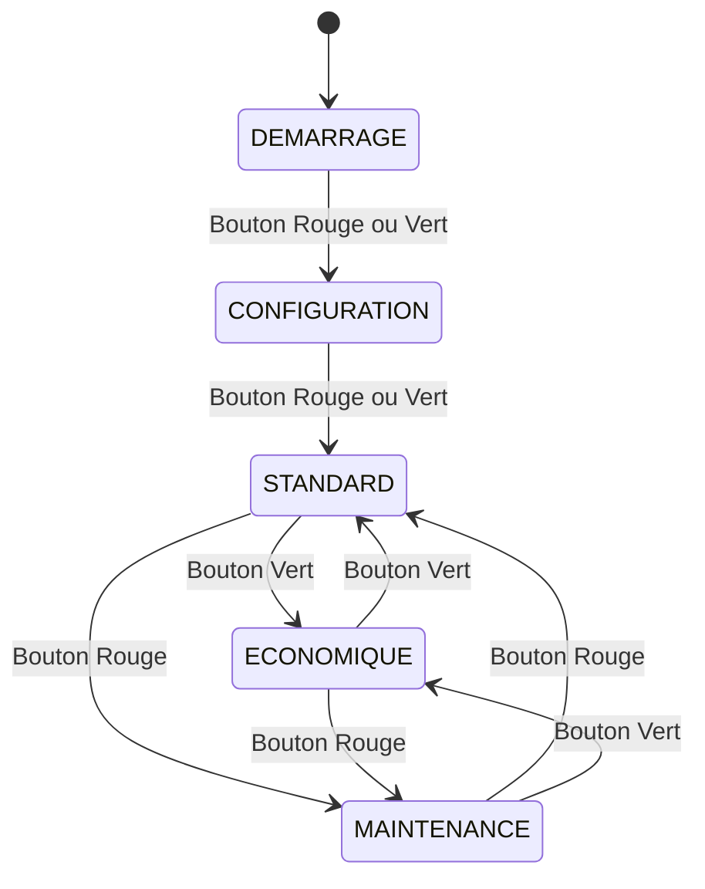
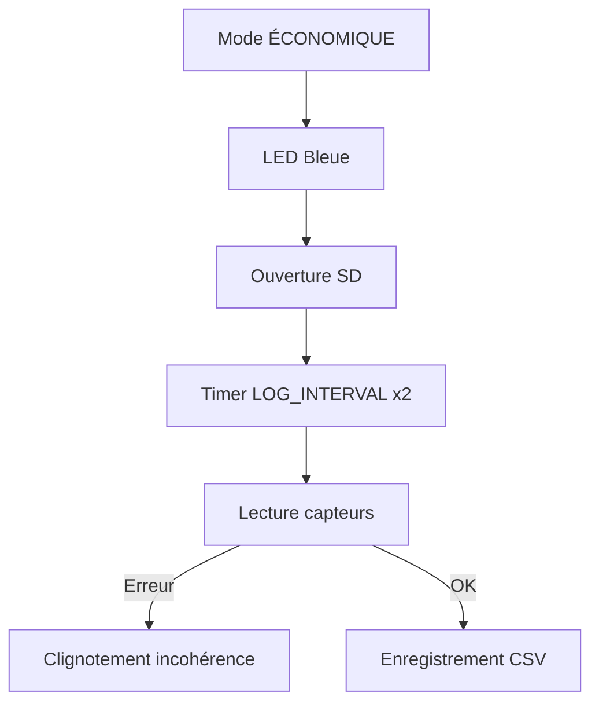
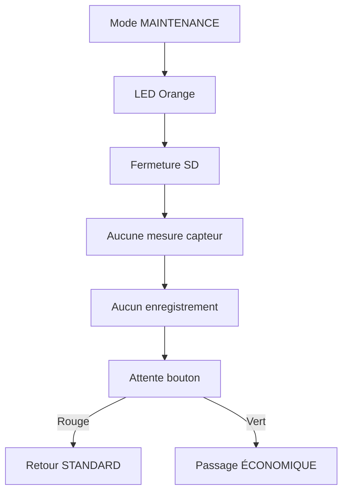

Je te propose une structure en 5 parties :

1. **Vue globale des transitions entre modes**  
2. **Mode DÉMARRAGE**  
3. **Mode CONFIGURATION**  
4. **Mode STANDARD**  
5. **Mode ÉCONOMIQUE**  
6. **Mode MAINTENANCE**

Si tu veux, je peux aussi générer des versions *flowchart*, *state diagram*, ou *sequence diagram* selon ton usage (README, rapport, cours…).

---

# Vue globale — Diagramme des transitions entre modes



### Explication
Ce diagramme représente **toutes les transitions possibles** définies dans `gererBoutons()`.  
Chaque pression de bouton change l’état selon une logique précise :

- **Rouge** → transitions vers CONFIG, STANDARD, MAINTENANCE  
- **Vert** → transitions vers CONFIG, STANDARD, ÉCO  
- Le mode DÉMARRAGE mène toujours à CONFIGURATION.

---

# Mode DÉMARRAGE

```mermaid
flowchart TD
    A [Mode DEMARRAGE] --> B[Affichage LCD : "Mode Demarrage"]
    B --> C[LED blanche]
    C --> D[Attente pression bouton]
    D -->|Rouge ou Vert| E[Passage en MODE CONFIGURATION]
```

### Explication
Le mode **DÉMARRAGE** est un état transitoire :

- Le LCD affiche *"Mode Demarrage"*  
- La LED est blanche  
- Aucune mesure n’est effectuée  
- Le système attend une pression sur un bouton  
- Rouge ou Vert → passage en **CONFIGURATION**

---

# Mode CONFIGURATION

```mermaid
flowchart TD
    A[Mode CONFIGURATION] --> B[LED Jaune]
    B --> C[Affichage LCD : "Mode Config"]
    C --> D[Lecture commandes série]
    D -->|LOG_INTERVAL=...| E[Mise à jour EEPROM]
    D -->|MIN/MAX capteurs| F[Mise à jour seuils]
    D -->|RESET| G[Réinitialisation paramètres]
    D -->|VERSION| H[Affichage version & lot]
    C --> I[Attente bouton]
    I -->|Rouge ou Vert| J[Passage en STANDARD]
```

### Explication
En mode **CONFIGURATION** :

- La LED est **jaune**
- Le LCD affiche *"Mode Config"*
- Le système écoute les commandes série :
  - `LOG_INTERVAL=`
  - `MIN_TEMP_AIR=`, `MAX_TEMP_AIR=`
  - `HYGR_MIN=`, `HYGR_MAX=`
  - `MIN_LUMIN=`, `MAX_LUMIN=`
  - `RESET`
  - `VERSION`
- Une pression sur Rouge ou Vert → passage en **STANDARD**


# Mode STANDARD

```mermaid
flowchart TD
    A[Mode STANDARD] --> B[LED Verte]
    B --> C[Ouverture SD]
    C --> D[Timer 1s → flagHorloge]
    C --> E[Timer LOG_INTERVAL → flagCapteurs]

    D --> F[Affichage heure + état GPS]

    E --> G[Lecture DHT11 / Luminosité]
    G -->|Erreur capteur| H[Clignotement rouge/vert + LCD "erreur capteur"]
    G -->|OK| I[Lecture GPS]
    I --> J[Enregistrement CSV sur SD]
    J -->|SD pleine| K[sdFull = true → blocage]
```

### Explication
Le mode **STANDARD** est le mode principal :

- LED **verte**
- SD ouverte automatiquement
- Toutes les `LOG_INTERVAL` secondes :
  - Lecture température, humidité, luminosité
  - Vérification des seuils
  - Lecture GPS
  - Enregistrement dans `donnees.csv`
- Chaque seconde :
  - Affichage de l’heure
  - Indication GPS (fix ou non)
- En cas d’erreur capteur → clignotement rouge/vert
- En cas de SD pleine → blocage + message

---

# Mode ÉCONOMIQUE



### Explication
Le mode **ÉCONOMIQUE** est identique au mode STANDARD, sauf :

- LED **bleue**
- Intervalle de mesure **doublé** :  
  \(\text{intervalle} = LOG\_INTERVAL \times 2\)
- Objectif : réduire consommation et fréquence d’écriture SD

---

# Mode MAINTENANCE



### Explication
Le mode **MAINTENANCE** :

- LED **orange**
- La SD est **fermée**
- Aucun capteur n’est lu
- Aucun enregistrement n’est fait
- Idéal pour manipuler le matériel sans risque d’écriture SD

